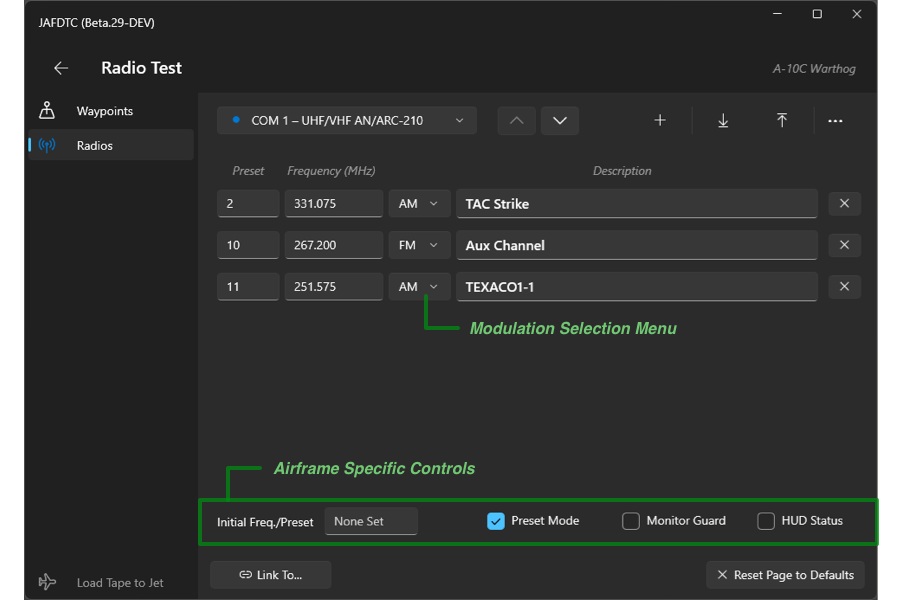

# JAFDTC: Configuring A-10C Warthog Airframes

*Version 1.0.0-B.31 of 5-May-24*

JAFDTC supports configuration of the following systems in the A-10C II Warthog,

* Radios
* Waypoints
* Miscellanesou CDU and ADP Systems

Each of these areas is covered in more depth below. See the
[user's guide](https://github.com/51st-Vfw/JAFDTC/tree/master/doc)
and the
[common elements guide](https://github.com/51st-Vfw/JAFDTC/tree/master/doc/Common_Elements.md)
for more on the aspects of JAFDTC that are common to multiple airframes.

> JAFDTC does not support the original DCS A-10C module.

# DCS Cockpit Integration

> This functiuonality requires installation of the DCS Lua support. 

The Warthog allows the user to operate JAFDTC from buttons in the cockpit without needing to go
through the Windows UI. This is helpful for VR and other situations where you may not be able
to interact with the JAFDTC window. To support this capabilty, JAFDTC reuses controls from
the UFC panel that have no function in the the A-10C that the module models.

JAFDTC currently supports the following functions from the Hawg cockpit,

* **IFF** &ndash; Pressing and briefly holding this button causes JAFDTC to load the
  currently selected A-10C configuration into the jet. JAFDTC provides feedback during the
  upload according to the **Upload Feedback**
  [setting](https://github.com/51st-Vfw/JAFDTC/tree/master/doc/README.md#settings).
* **COM SEC** &ndash; Changes the currently selected configuration on the
  [Configuration List Page](https://github.com/51st-Vfw/JAFDTC/tree/master/doc/README.md#configuration-list-page)
  to the previous configuration.
* **ECCM** &ndash; Changes the currently selected configuration on the
  [Configuration List Page](https://github.com/51st-Vfw/JAFDTC/tree/master/doc/README.md#configuration-list-page)
  to the next configuration.
* **IDM R/T** &ndash; Toggles pinning the JAFDTC window to the top of the window stack over the
  DCS window.

The initial press of **COM SEC** or **ECCM** will briefly display the name of the currently
selected configuration. Subsequent presses step up or down through the configuration list.

Other functions may be implemented later.

# Configurable Systems on the Warthog

A Warthog configuration supports settings spanning the systems listed above. All systems
implement the link and reset functionality mentioned in the overview of the
[system editor page](https://github.com/51st-Vfw/JAFDTC/tree/master/doc/README.md#system-editor-page).

Prior to uploading, you should ensure the relevant systems are powered up and functional.
Typically, uploads should occur as one of the last steps prior to taxi once you have systems
powered up, stores loaded, and so on.

## Radios

The system editor for the communications system in the Warthog follows the general outline of
the common
[Communications System Editor](https://github.com/51st-Vfw/JAFDTC/tree/master/doc/Common_Elements.md#communications-system-editors)
with some small changes for capabilities of the Warthog radios. The configuration supports the
AN/ARC-210 and AN/ARC-164 radios.

> Support for the AN/ARC-186 radio is planned for a future release.

The AN/ARC-164 radio most closely follows the common communiation systems editor and allows you
to specify preset frequencies and other configuration,

The airframe specific controls for the AN/ARC-164 include,

- **Initial Freq./Preset** &ndash; Specifies the initial frequency or preset to tune the
  radio to. For example, "15" sets the radio to preset 15 while "251.00" sets the radio to
  the manual frequency 251.00.
- **Preset Mode** &ndash; When selected, radio select frequencies through presets; otherwise,
  frequencies are set manually.
- **Monitor Guard** &ndash; When selected, configures the radio to automatically monitor the
  UHF guard frequncy.

Other controls work as described in
[Communications System Editor](https://github.com/51st-Vfw/JAFDTC/tree/master/doc/Common_Elements.md#communications-system-editors)
documentation.

The AN/ARC-210 radio support selectable modulation (FM or AM) on some frequency bands. In
addition to the Preset, Frequency, and Description information, this radio includes a drop
down menu to select modulation.

After changing the preset frequency, the modulation is initially set to the default modulation
for the frequency. The first item in the modulation drop down menu is always the default
modulation for the preset.

The airframe specific controls for the AN/ARC-210 include,

- **Initial Freq./Preset** &ndash; Specifies the initial frequency or preset to tune the
  radio to. For example, "15" sets the radio to preset 15 while "251.00" sets the radio to
  the manual frequency 251.00.
- **Preset Mode** &ndash; When selected, radio select frequencies through presets; otherwise,
  frequencies are set manually.
- **Monitor Guard** &ndash; When selected, configures the radio to automatically monitor the
  UHF guard frequncy.
- **HUD Status** &ndash; When selected, show the tuning information for the AN/ARC-210 in the
  HUD.

Other controls work as described in
[Communications System Editor](https://github.com/51st-Vfw/JAFDTC/tree/master/doc/Common_Elements.md#communications-system-editors)
documentation.

## Waypoints

JAFDTC uses the common
[Navigation System Editor](https://github.com/51st-Vfw/JAFDTC/tree/master/doc/Common_Elements.md#navigation-system-editors)
interface to set up the Warthog *Waypoint* system. Waypoints in the Warthog include elevation
and DDM (degrees, decimal minutes) formatted latitude and longitude to identify positions.

## Miscellaneous

The Miscellaneous System enables configuration of various settings. Many of these settings would typically be changed often in flight. The idea behind having them here is getting them set as desired before taxi/takeoff.

#### CDU Misc Configuration

- **Coordinate System** allows changing from the default L/L to MGRS. This only affects the CDU at present, not the TAD or TGP.
- **Bullseye on HUD** will make visible your aircraft's BULLS position in the upper right corner of the HUD.
- **FPM Flight Plan 01** allows changing the default flight plan, on the CDU FPM page, between manual and automatinc waypoint advancement.
- **STEER Page Speed Display** changes the speed displayed on the CDU's STEER page between IAS, TAS, and GS.

#### AAP Configuration

- **STEER PT** sets the AAP's STEER PT knob. Options are Flt Plan, Mark, and Mission.
- **PAGE** sets the AAP's PAGE knob. Options are Other, Position, Steer, and Waypt.

#### Autopilot Configuration

- **Mode** allows setting the autopilot mode switch between PATH, ALT/HDG, and ALT.
