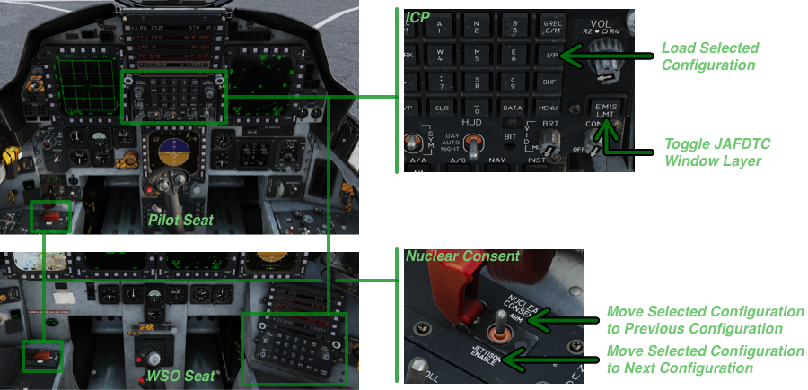
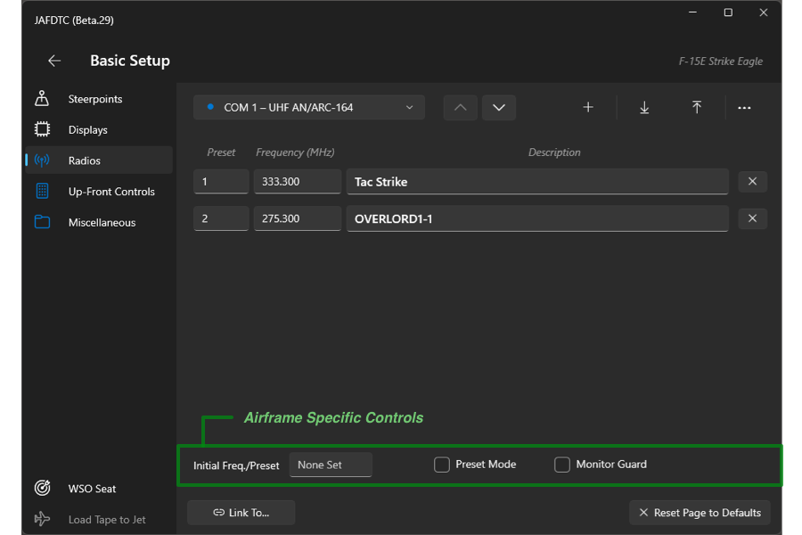

# JAFDTC: Configuring F-15E Strike Eagle Airframes

*Version 1.0.0-B.31 of 5-May-24*

JAFDTC supports configuration of the following systems in the Strike Eagle,

- Radios
- Steerpoints including routes, target points, and reference points
- Miscellaneous systems configured through UFC such as TACAN, ILS, and altitude warning
- Miscellaneous systems not configured through UFC such as BINGO

Each of these areas is covered in more depth below. See the
[_User's Guide_](https://github.com/51st-Vfw/JAFDTC/tree/master/doc/README.md) and
[_Common Elements Guide_](https://github.com/51st-Vfw/JAFDTC/tree/master/doc/Common_Elements.md)
for more on the aspects of JAFDTC that are common to multiple airframes.

# Pilots and WSOs

Configurations for the Strike Eagle are associated with either the pilot seat (front cockpit)
or WSO seat (rear cockpit). When presenting Strike Eagle configurations, the
[Configuration List Page](https://github.com/51st-Vfw/JAFDTC/tree/master/doc/README.md#configuration-list-page)
indicates the seat the configuration supports in the information line below the configuration
name,

To select the seat, use the Pilot/WSO control on the bottom left of the
[System Editor Page](https://github.com/51st-Vfw/JAFDTC/tree/master/doc/README.md#system-editor-page) to toggle between Pilot and WSO settings,

A configuration maintains settings for both seats. However, the user interface will only show
the settings relevant to the selected seat. For example, when the Pilot seat is selected, the
UI will not show controls to set up the rear seat MPD/MPCDs.

When loading a configuration into the jet, you must be positioned in the appropriate seat. For
example, if you attempt to load a WSO configuration while occupying the pilot seat, JAFDTC will
inform you of that the configuration does not match your seat and will leave avionics
unchanged.

> If both the pilot and WSO use JAFDTC, they should not upload their configurations to the jet
> at the same time. Because some front and back seat systems are shared, doing so can create
> the same issues that occur if someone tries to setup avionics while JAFDTC is running.

# DCS Cockpit Integration

> This functiuonality requires installation of the DCS Lua support. 

The Strike Eagle allows the user to operate JAFDTC from buttons in the cockpit without needing
to go through the Windows UI. This is helpful for VR and other situations where you may not be
able to interact with the JAFDTC window. To support this capabilty, JAFDTC reuses controls from
the UFC and nuclear consent panels that currently have no function in the the F-15E module.

On the UFC, JAFDTC currently supports two functions from the Strike Eagle cockpit,

* **IFF** &ndash; Pressing and briefly holding this button causes JAFDTC to load the
  currently selected A-10C configuration into the jet. JAFDTC provides feedback during the
  upload according to the **Upload Feedback**
  [setting](https://github.com/51st-Vfw/JAFDTC/tree/master/doc/README.md#settings).
* **EMIS LMT** &ndash; Toggles pinning the JAFDTC window to the top of the window stack over
  the DCS window.

For the nuclear consent panel, opening the cover reveals a switch with three-positions:
`ARM` (forward), `SAFE` (center), `JETTISON ENABLE` (aft). Manipulating this switch
changes the currently selected configration in the
[Configuration List Page](https://github.com/51st-Vfw/JAFDTC/tree/master/doc/README.md#configuration-list-page).

* **NUCLEAR CONSENT** set `SAFE` to `ARM` to `SAFE` &ndash; Changes the currently selected
  configuration to the previous configuration.
* **NUCLEAR CONSENT** set `SAFE` to `JETTISON ENABLE` to `SAFE` &ndash; Changes the currently
  selected configuration to the next configuration.

The initial toggle will briefly display the name of the currently selected configuration.
Subsequent toggles step up or down through the configuration list.

Other functions may be implemented later.

# Configurable Systems

A Strike Eagle configuration supports settings spanning the systems listed above appropriate
for the seat the configuration targets (for example, the BINGO setting is only available from
the pilot seat). All systems implement the link and reset functionality mentioned in the
overview of the
[system editor page](https://github.com/51st-Vfw/JAFDTC/tree/master/doc/README.md#system-editor-page).

Prior to uploading, you should ensure the relevant systems are powered up and functional.
Typically, uploads should occur as one of the last steps prior to taxi once you have systems
powered up, stores loaded, and so on.

## Radios

The system editor for the communications system in the Strike Eagle follows the general outline
of the common
[Communications System Editor](https://github.com/51st-Vfw/JAFDTC/tree/master/doc/Common_Elements.md#communications-system-editors)
with some small changes for capabilities of the Warthog radios. The configuration supports the
AN/ARC-210 and AN/ARC-164 radios.

> AN/ARC-210 only supports default moduilation

The AN/ARC-210 and AN/ARC-164 radios follows the common communication systems editor and allows
you to specify preset frequencies and other configuration,

The airframe specific controls for both the AN/ARC-210 and AN/ARC-164 include,

- **Initial Freq./Preset** &ndash; Specifies the initial frequency or preset to tune the
  radio to. For example, "15" sets the radio to preset 15 while "251.00" sets the radio to
  the manual frequency 251.00.
- **Preset Mode** &ndash; When selected, radio select frequencies through presets; otherwise,
  frequencies are set manually.
- **Monitor Guard** &ndash; When selected, configures the radio to automatically monitor the
  UHF guard frequncy.

Other controls work as described in
[Communications System Editor](https://github.com/51st-Vfw/JAFDTC/tree/master/doc/Common_Elements.md#communications-system-editors)
documentation.

## Steerpoints

The steerpoint configuration allows you to update the navigation system on the Mudhen. This
configuration includes steerpoints as well as target points and reference points relative to a
steerpoint. This editor extends the interface of the common navigation system editor the
[user's guide](https://github.com/51st-Vfw/JAFDTC/tree/master/doc/README.md#navigation-system-editors)
describes.

### Steerpoint List User Interface

The *Steerpoint List* editor lists the steerpoints currently known to the configuration.
This editor extends the interface of the common *Navigation Point List* the
[user's guide](https://github.com/51st-Vfw/JAFDTC/tree/master/doc/README.md#navigation-point-list)
describes.

TODO

### Steerpoint Editor User Interface

The *Steerpoint* editor edits a steerpoint currently known to the configuration along with any
associated referenced points. This editor extends the interface of the common
*Navigation Point Editor* the
[user's guide](https://github.com/51st-Vfw/JAFDTC/tree/master/doc/README.md#navigation-point-editor)
describes.

TODO

### Importing

TODO: also need to handle "navigation target points" from me lua

When importing steerpoints from `.miz` or `.cf` files, JAFDTC can set up target and reference
points based on the steerpoint names provided by the file. This allows imports to include
information that the source tool (DCS Mission Editor, CombatFlite) may not directly support.

> When importing from `.json`, these reference points are automatically handled without
> requring any specific naming conventions.

JAFDTC looks for steerpoints that include a hashtag (that is, "`#`" followed by text) in their
name to set up reference points,

| Hashtag   |Purpose|
|:---------:|:------|
| `#T`      | Makes the steerpoint a target point |
| `#.<num>` | Reference point `<num>`, where `<num>` is between 1 and 7, inclusive |

Steerpoints whose name contains an unknown hashtag are always ignored.

For example, assume you have a `.miz` file with a Mudhen flight `DUDE1` with the following
steerpoints,

| # | Position | Name |
|:-:|:--------:|------|
| 1 |    P1    | `Ingress` |
| 2 |    P2    | `Enroute` |
| 3 |    P3    | `Enroute#.1` |
| 4 |    P4    | `IP` |
| 5 |    P5    | `Target` |
| 6 |    P6    | `Target#.1` |
| 7 |    P7    | `Homeplate` |

In this table, each steerpoint has a number, a position (latitude, longitude, and elevation),
and a name set through the appropriate fields in, for example, the DCS Mission Editor.
Importing the steerpoints for `DUDE1` leads to the following steerpoints and reference
points being set up in the navigation system,

| #  | Position | Name        | Target? | Reference Point 1 |
|:--:|:--------:|:-----------:|:-------:|:-----------------:|
| 1A |    P1    | `Ingress`   | No      | &ndash;
| 2A |    P2    | `Enroute`   | No      | 2.1A at P3
| 3A |    P4    | `IP`        | No      | &ndash;
| 4A |    P5    | `Target`    | Yes     | 5.01A at P6
| 5A |    P7    | `Homeplate` | No      | &ndash;

For brevity, this table only includes reference point 1 as other reference points do not appear
in this example.

## Miscellaneous

TODO