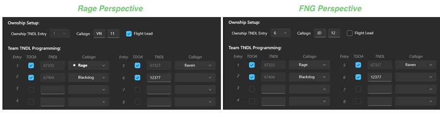
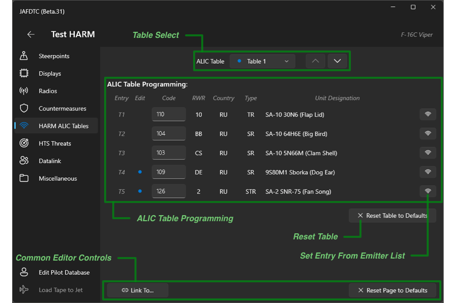
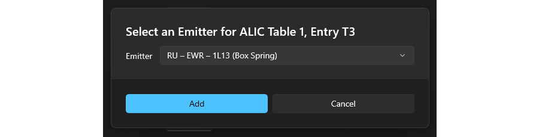
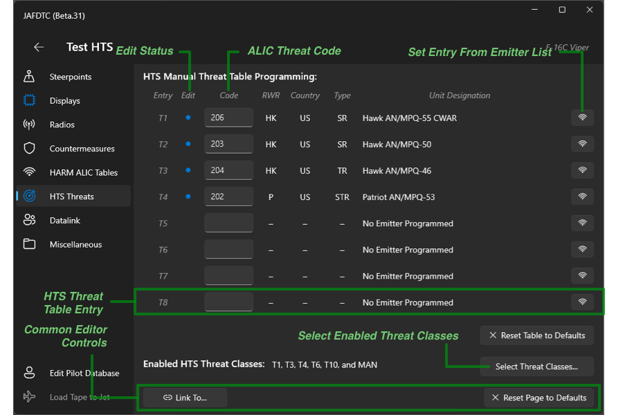
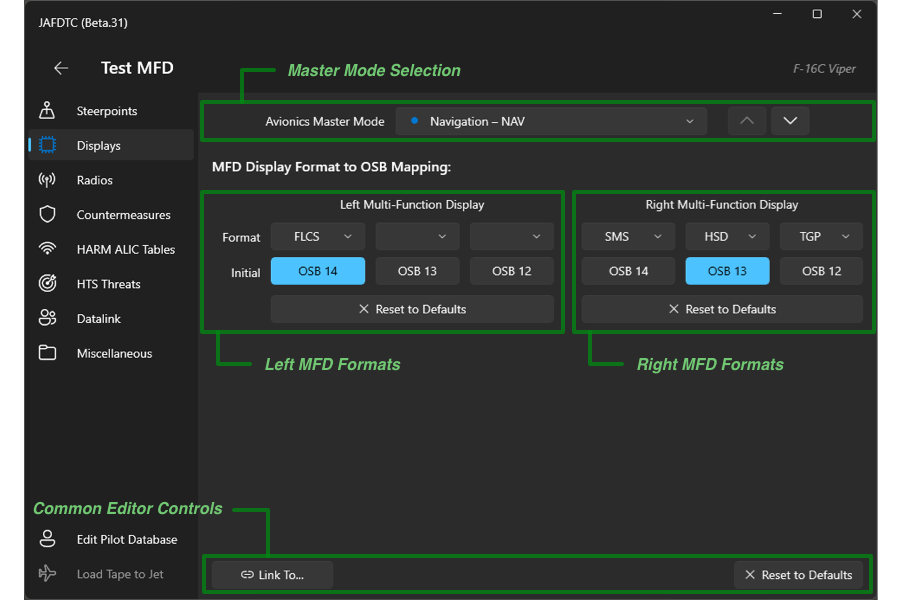
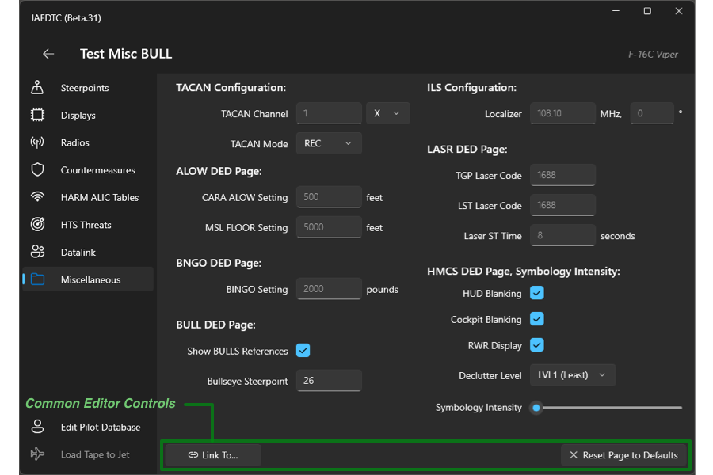
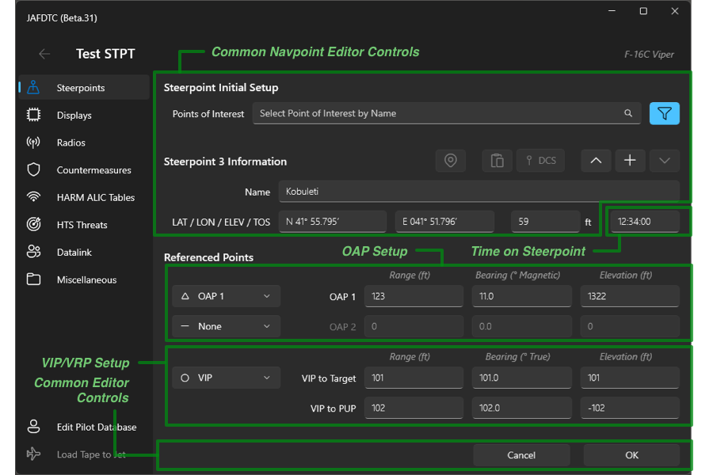

# JAFDTC: Configuring F-16C Viper Airframes

**_Version 1.1.0 of TODO_**

JAFDTC supports configuration of the following systems in the Viper,

* [Countermeasures](#countermeasures)
* [Datalink](#datalink)
* [Data Cartridge](#data-cartridge-dtcdte)
  (DTE/DTC)
* [HARM ALIC](#harm-alic)
  threat tables
* [HARM HTS](#harm-hts)
  manual threat table and sensor threat classes
* [MFD formats](#mfd-formats)
  across all master modes and initial format selections
* [Miscellaneous DED](#miscellaneous)
  systems such as TACAN/ILS, ALOW, BNGO, BULL, LASR, HMCS DED/UFC, and HMCS intensity
* [Radios](#communications)
* [SMS](#sms-munitions)
  munitions parameters
* [Steerpoints](#steerpoints)
  including OAP, VIP, and VRP reference points

Each of these areas is covered in more depth below. See the
[_User's Guide_](https://github.com/51st-Vfw/JAFDTC/tree/master/doc/README.md) and
[_Common Elements Guide_](https://github.com/51st-Vfw/JAFDTC/tree/master/doc/Common_Elements.md)
for more on the aspects of JAFDTC that are common to multiple airframes.

# DCS Cockpit Interactions

The Viper allows the user to operate JAFDTC from buttons in the cockpit without needing to go
through the Windows UI. This is helpful for VR and other situations where you may not be able
to interact with the JAFDTC window. To support this capabilty, JAFDTC reuses controls from
the FLIR panel on the UFC that have no function in the the Block 50 Viper that the module
models.

JAFDTC currently supports three functions from the Viper cockpit,

- **FLIR WX** (1) &ndash; Pressing and briefly holding this button can trigger one of two
  actions, depending on the duration the button is held down,
  -  A press between 0.2s and 1.0s causes JAFDTC to load the currently selected F-16C
    configuration into the jet. JAFDTC provides feedback during the upload according to the
    **Upload Feedback**
    [setting](https://github.com/51st-Vfw/JAFDTC/tree/master/doc/README.md#settings).
  - A press longer than 1.0s causes JAFDTC to open up the in-mission DCS DTE interface. Prior
    to doing so, JAFDTC will generate the merged `.dtc` according to the settings of the
    [DTC system](#data-cartridge-dtcdte).
- **FLIR Rocker Switch** (2) &ndash; Pressing the `UP` and `DOWN` sides of the rocker moves to
  the previous and next configurations, respectively. On the first press, JAFDTC briefly
  displays the name of the currently selected configuration. Subsequent presses step up or
  down through the configuration list.
- **FLIR GAIN/LVL/AUTO** (3) &ndash; Controls window stacking behavior based on switch
  position,
  - `GAIN` &ndash; Keeps the JAFDTC window on top of the DCS window in the window stack.
  - `LVL` &ndash; Allows the JAFDTC window to be below the DCS window in the window stack and
    does not force any particular ordering.

Other functions may be implemented later.

# Pilot Roles for Import

The Viper supports pilot roles when importing from a `.jafdtc` file. Roles allow JAFDTC to
customize the imported file based on your role in the flight as
[discussed earlier](https://github.com/51st-Vfw/JAFDTC/tree/master/doc/Common_Elements.md#importing-configurations-from-similar-airframes).
and are entered into the area (2) text box from the
[import dialog figure](https://github.com/51st-Vfw/JAFDTC/tree/master/doc/Common_Elements.md#sharing-configurations).
For the Viper, JAFDTC can adjust the following parameters in the imported configuration based
on the entered rolerole,

- Ownship callsign in the
  [Datalink System](#datalink).
- Ownship flight/element number in the
  [Datalink System](#datalink).
- Ownship flight lead status in the
  [Datalink System](#datalink).
- TACAN yardstick setup in the
  [Miscellaneous System](#miscellaneous).

The role is specified by giving the callsign information for the pilot importing the `.jafdtc`
along with the TACAN for the flight lead. Both of these are optional.

The callsign is specified in the "CCnn" format. For example, *JEDI 2-3* is represented as
*JI23*, *VENOM1-1* as *VN11*, and so on. TACAN is specified as a channel; for example, 39Y,
40X, etc. The following table presents some examples,

|Role Text  |Callsign   |F/E        |Is Lead?   |TACAN Channel|TACAN Mode |
|:---------:|:---------:|:---------:|:---------:|:-----------:|:---------:|
|`CY23 39X` | CY        | 23        | No        | 102X        | A/A TR    | 
|`LO31 41X` | LO        | 31        | Yes       | 41X         | A/A TR    | 
|`VN11`     | VN        | 11        | Yes       | Unchanged   | Unchanged |
|`38Y`      | Unchanged | Unchanged | Unchanged | 38Y or 101Y | A/A TR    |

The *Role Text* would be entered in area (2) of the import dialog shown in the
[_Common Elements Guide_](https://github.com/51st-Vfw/JAFDTC/tree/master/doc/Common_Elements.md#sharing-configurations).
In the table above, "unchanged" implies the parameter value in the `.jafdtc` file is not
changed during import. At import, JAFDTC attempts to determine the flight/element number of
the pilot with the following procedure,

- Callsign from the role string provied during import.
- If there is no callsign in the role, infer the flight/element number by looking for the
  pilot matching the pilot name from the
  [JAFDTC Settings](ttps://github.com/51st-Vfw/JAFDTC/tree/master/doc/README.md#settings)
  in the datalink team table from the configuration.
- If unable to infer from datalink team, use the value from the configuration.

Once the element number is known, the lead and TACAN setup can be determined with the
assumption that lead will setup a yardstick will all members of the flight (with lead on
TACAN channel number *T* and all others on TACAN channel number *T*&nbsp;+&nbsp;63; for
example 38Y and 101Y).

# Configurable Systems on the Viper

A Viper configuration supports settings spanning eight systems as described below. All systems
implement the link and reset functionality mentioned in the overview of the
[system editor page](https://github.com/51st-Vfw/JAFDTC/tree/master/doc/README.md#system-editor-page).

Priort to uploading, you should ensure the relevant systems are powered up and functional.
Typically, uploads should occur as one of the last steps prior to taxi once you have systems
powered up, stores loaded, and so on.

## Communications

The communications configuration allow you to update the presets and initial configuration of
the COM1 (UHF) and COM2 (VHF) radios in the Viper. This configuration includes the presets as
well as the initial radio frequency and whether or not to setup to monitor guard. This editor
extends the interface of the common communication system editor the
[_User's Guide_](https://github.com/51st-Vfw/JAFDTC/tree/master/doc/README.md#communications-system-editors)
describes.

Working from top to bottom, the primary components of this page include,

1. [**_Radio Selection_**](#radio-selection-and-preset-list)
   &ndash; Selects the radio being edited and adds presets to the preset list.
2. [**_Preset List_**](#radio-selection-and-preset-list)
   &ndash; Lists currently defined presets.
3. [**_Radio Details_**](#radio-details)
   &ndash; Sets some per-radio settings.
4. **_Common Editor Controls_**
   &ndash; Common controls for system editors as described earlier in the
   [_User's Guide_](https://github.com/51st-Vfw/JAFDTC/tree/master/doc/README.md#common-editor-controls).

The reaminder of this section discusses these elements in more detail.

### Radio Selection and Preset List

The main portion of the radio interface in areas (1) and (2) functions as described earlier
in the
[_User's Guide_](https://github.com/51st-Vfw/JAFDTC/tree/master/doc/README.md#common-editor-controls).
The Viper supports up to 20 presets on each of its two radios.

### Radio Details

The Viper editor includes additional controls beyond those in the common 
[radio interface](https://github.com/51st-Vfw/JAFDTC/tree/master/doc/README.md#communications-system-editors)
located in area (3) between the preset list and common editor controls. For both COM1 and
COM2, these controls include a text box to set the initial frequency or preset to select
after uploading the configuration to the jet. The background of this field will turn red if
the value is invalid.

> Unless there is an initial frequency or preset specified, JAFDTC will not change the
> frequency tuned on a radio from the default frequency.

In addition, for the COM1 (UHF) radio, the controls provide an option to configure the radio
to monitor the UHF guard frequency (243.000 MHz).

### Integration with DCS DTC

The presets configured in this editor can be merged with the merged DTC tape as described
in the
[_Common Elements Guide_](https://github.com/51st-Vfw/JAFDTC/tree/master/doc/Common_Elements.md#working-with-the-native-dcs-dtc).
For the Viper, any COM1 or COM2 presets defined in the JAFDTC UI are copied into the merged
tape when the system is set to be merged. Regardless of the DTC settings, JAFDTC will contine
to set up the initial frequency/preset and guard monitoring as these parameters are not
configured by the DCS DTC.

## Countermeasures

The countermeasures system manages parameters set through the CMDS DED page. These parameters
control the operation of the countermeasures and allow you to setup different programs for the
chaff and flare dispensers.

Working from top to bottom, the primary components of this page include,

1. [**_System Parameters_**](#countermeasure-system-parameters)
   &ndash; Sets system-wide parameters.
2. [**_Countermeasure Program Editor_**](#countermeasure-program-editor)
   &ndash; TODO.
3. [**_Countermeasure Programe Visualizer_**](#countermeasure-program-visualizer)
   &ndash; TODO.
4. **_Common Editor Controls_**
   &ndash; Common controls for system editors as described earlier in the
   [_User's Guide_](https://github.com/51st-Vfw/JAFDTC/tree/master/doc/README.md#common-editor-controls).

The reaminder of this section discusses these elements in more detail.

### Countermeasure System Parameters

The system parameters include the BINGO levels for chaff and flares and are set in area (1).
These values determine the number of consumables (flares or chaff) that trigger a BINGO
warning from the avionics.

### Countermeasure Program Editor

The Viper supports six countermeasure programs: MAN1, MAN2, MAN3, MAN4, PANIC, and BYPASS. Each
program has settings for the sequencing of dispnesing flares and chaff when running the
program. The program selection menu at the top of area (2) selects which of the programs is
being edited in the chaff and flare columns below. A blue dot next to the program name in the
program selection menu indicates the program has been changed from default values. The upward-
and downward-pointing chevrons to the right of the progam selection menu step through the
available programs.

In the chaff and flare columns, you can edit the burst quantity (BQ), burst interval (BI),
salvo quantity (SQ), and salvo interval (SI) parameters for the program selected in the
program menu. The background of the field will turn red if you enter a value that is outside
of the allowable range. Clicking the reset button at the bottom of the column will reset all
four of the parameters (BQ, BI, SQ, and SI) in the column to their default values.

### Countermeasure Program Visualizer

Below the programming table is a graphical representation of the countermeasure programs. This
shows the timing of the flare and chaff releases on a common timeline. Gold circles represent
flares while teal diamonds represent chaff.

### Integration with DCS DTC

The presets configured in this editor can be merged with the merged DTC tape as described
in the
[_Common Elements Guide_](https://github.com/51st-Vfw/JAFDTC/tree/master/doc/Common_Elements.md#working-with-the-native-dcs-dtc).
For the Viper, the CMDS programs for the MAN1-MAN4, PANIC, and BYPASS programs along with
BINGO levels are copied into the merged tape when the system is set to be merged.

## Datalink

The datalink system manages parameters set through the DED DLNK page. These parameters control
operation of the datalink system and allow you to assign aircraft to your "team" for the
purpose of sharing information. By default, the system shares contact information between the
team and may optionally share information used by the HTS pod to locate emitters.

For example, consider the following setup for a SEAD sortie where VENOM1 and JEDI1 flights
will work together,

|Callsign   |Pilot     |TNDL   |   |Callsign  |Pilot      |TNDL   |
|:---------:|:--------:|:-----:|---|:--------:|:---------:|:-----:|
| VENOM 1-1 | Rage     | 67333 |   | JEDI 1-1 | Raven     | 67327 |
| VENOM 1-2 | Blackdog | 67404 |   | JEDI 1-2 | Cadet FNG | 12377 |

Here, we have two 2-ships that are going to be part of the same team. We will set the data link
up such that Venom shows up as #1 and #2 on HSD and Jedi shows up as #5 and #6. All four jets
will share HTS information.

When set up, the datalink system editor page looks like this (from Rage's perspective),

Working from top to bottom, the primary components of this page include,

1. [**_Ownship Setup_**](#ownship-setup)
   &ndash; Sets parameters related to the ownship including TNDL entry, callsign, and flight
   lead status.
2. [**_TNDL Table Setup_**](#tndl-table-setup)
   &ndash; Sets the contents of the team TNDL table in the datalink system.
3. [**_Pilot Database Access_**](#pilot-database)
   &ndash; Opens the Viper pilot database editor.
4. **_Common Editor Controls_**
   &ndash; Common controls for system editors as described earlier in the
   [_User's Guide_](https://github.com/51st-Vfw/JAFDTC/tree/master/doc/README.md#common-editor-controls).

The reaminder of this section discusses these elements in more detail.

### Ownship Setup

The top-most section of the page in area (1) allows you to select parameters related to the
ownship. These include the TNDL table entry for your ownship, your callsign, and whether or not
you are a flight lead. Dashes in the callsign fields indicates JAFDTC will not change the
callsign set up in the jet. As
[discussed below](#setting-up-multiple-pilots),
JAFDTC will automatically set the ownship table entry when it can determine which entry corresponds to the ownship.

### TNDL Table Setup

The middle part of the page in area (2) allows you to edit the entries in the TNDL table that
specify details on team members. For each table entry, there are three controls,

* **TDOA** &ndash; Enables or disables sharing of HTS information within the team.
* **TNDL** &ndash;  Specifies the five-digit octal code assigned to the jet (that is, 5 digits
  where all digits are between 0 and 7, inclusive).
* **Callsign** &ndash; Selects a pilot from the
  [pilot database](#setting-up-multiple-pilots)
  or a "generic" pilot.

The TNDL field is only editable if the callsign control does not select a pilot from the pilot
database (in this case, the callsign control is blank as in entry 8 above). The background of
the TNDL field will turn red when the value in the field is invalid. Selecting yourself from
the pilot database will cause JAFDTC to track the corresponding entry as your ownship. Your
pilot entry in the database is indicated by a bullet (see entry 1 above) and is determined by
looking for a callsign in the pilot database that matches the callsign set through the
[JAFDTC settings](https://github.com/51st-Vfw/JAFDTC/tree/master/doc/README.md#settings).

> You should make sure to set up your callsign through the
> [JAFDTC settings](https://github.com/51st-Vfw/JAFDTC/tree/master/doc/README.md#settings)
> to get the most out of the Viper datalink support in JAFDTC.

The button below the table allows you to swap entries 1-4 and 5-8. The checkbox at the bottom
of the area specifies a TNDL value to enter in any empty table entries (if left unspecified,
JAFDTC will not change these entries from whatever happends to be in the avionics).

### Pilot Database

The pilot database associates callsigns with fixed TNDL numbers to allow you to rapidly
construct Viper datalink configurations. Clicking on the button in area (3) brings up the
Viper pilot database editor,

The primary components of this page include,

1. [**_New Pilot Information_**](#adding-a-new-pilot-to-the-database)
   &ndash; Adds new pilots to the database.
2. [**_Pilot Delete Button_**](#deleting-pilots-from-the-database)
   &ndash; Deletes pilots selected in the pilot database list from the database.
3. [**_Import and Export_**](#deleting-pilots-from-the-database)
   &ndash; Imports and exports the pilot database from `.jafdtc_db` files.
4. [**_Pilot Database List_**](#pilot-database-list)
   &ndash; Lists the current contents of the pilot database.

The reaminder of this section discusses these elements in more detail.

#### Adding a New Pilot to the Database

To add a new pilot, simply enter a unique callsign (case is ignored) along with a vaild 5-digit
TNDL, then click the `+` button. The background of either of these fields will be red if they
contain an invalid value. You will not be allowed to add a pilot until both the callsign and
TNDL value are valid.

> Once entered, pilots cannot be edited. To update a pilot, delete their record and then add a
> new record with the desired updates.

#### Pilot Database List

The pilot data base list in area (2) lists the pilots in the current database along with
their TNDL numbers. The list supports multiple selections (with either `SHIFT` or `ALT` clicks
as usual).

#### Deleting Pilots from the Database

To delete pilots, select them in the pilot list in the center of the display. After selecting
the pilots to delete, click the trashcan icon in area (3) to perform the delete. This operation
cannot be undone, so JAFDTC will first prompt you to confirm the delete.

#### Pilot Database Import and Export

The import and export buttons in area (4) allow you to share pilot databases with others.
To export, click the export button. This will bring up a standard file selection dialog
that will let you specify a `.jafdtc_db` file to save the exported database to.

Import is similar. After selecting import, a standard file selection dialog is displayed
that lets you specify a `.jafdtc_db` file to import from. Imports replace the **entire**
database and cannot be undone, so JAFDTC will first prompt you to confirm the import.

**TODO** discuss double-click installs of `.jafdtc_db` when supported

### Setting Up Multiple Pilots

All pilots within a team should set up the datalink team table with the same pilots in the
*same* entries. That is, in our exmaple flight, all four pilots should have Rage in entry 1,
Blackdog in entry 2, Raven in entry 5 and FNG in entry 6.

Generally, when using the Viper DLNK, it is helpful to have a shared common
[pilot database](#pilot-database)
that everone can use. The pilot database
[export/import](#pilot-database-import-and-export)
functions are useful in making sure everyone is working from the same database. In a virtual
squadon environment, it is useful to have a single common database containing all pilots that
all pilots can share.

> Because of the way in which JAFDTC works, it is not enough for individuals to independently
> build their own databases that contain the same pilots.

Though all members of the team configure the team tables the same, what the pilots see differs,

**TODO REBUILD**

Here, Rage's perspective is on the left and FNG's perspective is on the right. For Rage,

* JAFDTC recognizes entry 1 as ownship since the callsign ("Rage") matches the callsign in
  the
  [JAFDTC settings](https://github.com/51st-Vfw/JAFDTC/tree/master/doc/README.md#settings)
  and sets the ownship entry to 1 (note the ownship control is disabled because JAFDTC can
  determine which table entry corresponds to ownship). The bullet and bold text in the
  callsign indicates the entry JAFDTC believes matches.
* JAFDTC fills in the TNDL with the value from the
  [pilot database](#pilot-database)
  for Rage (67333).
* As Rage is flight lead for VENOM1, he will check "Flight Lead" and set the appropriate
  callsign for VENOM1-1.

For FNG,

* The callsign is set to "generic" (that is, blank), FNG must set her ownship entry manually
  to 6 (note the ownship control is enabled as JAFDTC cannot determine which entry corresponds
  to ownship in this case).
* As the callsign in the TNDL table is generic, FNG must enter her TNDL (12377) into the TNDL
  field in entry 6.
* As FNG is a wingman ("...and if you're not a wingman, then to hell with you..." - DG), she
  does not check flight lead and sets the appropriate callsign for JEDI1-1.

When using shared `.jafdtc` files as the basis for a configuration, you can manually set
various fields (callsign, ownship, flight lead, etc.) from the source `.jafdtc` file.
There is also automation to help with this task as discussed in the
[next section](#adjusting-roles-during-import).

### Adjusting Roles During Import

The pilot roles used when importing from a `.jafdtc` file can greatly simplify some of the
per-pilot datalink setup mentioned above. See the
[earlier discussion](#pilot-roles-for-import)
for links to the discussion in the
[_Common Elements Guide_](https://github.com/51st-Vfw/JAFDTC/tree/master/doc/Common_Elements.md#importing-configurations-from-similar-airframes)
along with information on the capability.

We'll revisit our earlier VENOM1 and JEDI1 example to see how the pilot roles and sharing
`.jafdtc` files work together to automatically handle some aspects of data link setup.
First, someone in the mission would build a JAFDTC configuration for the mission. In our
exmaple, that only contain setup for the data link system, but, in general, it could also
include common setup for other systems in the jet (as the sortie is SEAD, it might
include ALIC or HTS setup).

In our example, let's assume Rage builds a configuration for the flight and exports it as
a `.jafdtc` file. The data link system is configured as
[shown above](#setting-up-multiple-pilots).

## Data Cartridge (DTC/DTE)

The data cartridge system in the Viper follows the common 
[user interface](https://github.com/51st-Vfw/JAFDTC/tree/master/doc/Common_Elements.md#user-interface-for-dtc-interoperation)
outlined earlier (the general discussion of
[interpoerating with the native DCS DTC](https://github.com/51st-Vfw/JAFDTC/tree/master/doc/Common_Elements.md#working-with-the-native-dcs-dtc)
may also be helpful). The Viper can merge its
[countermeasures](#countermeasures)
and
[communications](#communications)
systems with the native ED DCS DTC.

## HARM ALIC

The HARM ALIC system manages parameters set through the HARM DED page.

> To configure the ALIC table, a HARM must be loaded on the jet and powered on before
> JAFDTC can update this configuration. If these conditions are not met, the avionics will
> not allow JAFDTC to access the ALIC tables for programming.

These parameters control the progarmming of the three ALIC tables that specify the threats
(i.e., radar emitters) an AGM-88 HARM can target.

**TODO REBUILD**

The editor allows you to edit specific countermeasure programs in the countermeasure
system.  The common controls implement the link and reset functionality described
[earlier](https://github.com/51st-Vfw/JAFDTC/tree/master/doc/README.md#common-editor-controls).

### Table Selection

The Viper supports three ALIC tables: 1, 2, and 3. The table selection menu selects which of
the tables is being edited in the remainder of the view. A blue dot next to the table name in
the table select menu indicates the table has been changed from default values. The upward-
and downward-pointing chevrons to the right of the table selection menu step through the
tables.

### ALIC Table Programming

Each ALIC table has five entries, T1 through T5, that identify an emitter the HARM can target.
The columns in this table identify the information in each ALIC table entry,

- **Entry** &ndash; Entry number for the table.
- **Edit** &ndash; A blue dot in this column indicates that the entry has been changed from
  its default vaule.
- **Code** &ndash; An editable field for the ALIC code of the emitter to set the entry to.
- **RWR** &ndash; RWR symbology for the emitter.
- **Country**, **Type**, **Description** &ndash; Information on the emitter.

You can change the targeted emitter by entering the appropirate code in the edit field. A
blue dot to the left of the field indicates the table entry has changed form the default.
Codes can be found in DCS documentation. In addition, clicking the emitter button on the
right side of each entry will bring up a dialog that will let you select an emitter from
a list of known emitters.

Below the table entries is a button that resets the table contents to their default values.
Clearing the code field in an entry will also reset that specific entry to its default value.

## HARM HTS

The HTS system for the Viper includes threat tables that serves a similar function to the
[HARM ALIC](#harm-alic)
table.

> To configure the HARM HTS, a HARM and the HTS must be loaded on the jet and powered on before
> JAFDTC can update this configuration. If these conditions are not met, the avionics will
> not allow JAFDTC to access the HARM HTS for programming.

It defines which emitters the HTS can recognize and target. The HTS system includes
several pre-defined, fixed, tables and a manual table, MAN, that can be set by the pilot to
tailor known threats.

**TODO REBUILD**

The structure of this editor is similar to the
[HARM ALIC](#harm-alic).

### HTS MAN Table Programming

The HTS MAN table has eight entries that occupy the bulk of the page. Each row corresponds
to an entry that can specify a known emitter and operates exactly as the ALIC table entries
in the
[HARM ALIC](#alic-table-programming)
table. See the
[earlier discussion](#harm-alic)
for further details.

The *Select Threat Classes* button opens up a page that lists the HTS threat tables and
allows you to select which tables are active.

### Selecting Active Threat Classes

The HTS system supports 12 threat tables, 11 fixed and one MAN table that can be programmed.
The *Select Threat Classes* button allows you to specify which tables are active in the HTS
(the HTS will scan for emitters in the active tables). Active tables are selected with the
following page,

**TODO REBUILD**

To enable or disable a table, click on the checkbox in the corresponding row. Generally,
scan time increases with the number of tables selected so it is desirable to limit the
number of active tables.

The active tables are only set on the jet if you have the HTS format selected for one of
your MFDs (see
[MFD Formats](#mfd-formats)
below).

## MFD Formats

The MFD formats configuration selects which display formats are associated with OSB 12-14 on
the left and right MFDs. This mapping between OSB and display format is unique to each
master mode (NAV, A2G, A2A, Dogfight Missile Override, and Dogfight Override).

**TODO REBUILD**

The top row of the editor has a menu to select the master mode to update. The up and down
chevron buttons to the right of the menu step through the modes in the menu.  The common
controls implement the link and reset functionality described
[earlier](https://github.com/51st-Vfw/JAFDTC/tree/master/doc/README.md#common-editor-controls).

Below the master mode selection controls are two groups of controls that setup the
configuration for the left and right MFD in the selected master mode. The *Reset* button will
return the MFD format setup to default. The *Format* and *Initial* rows set the format and
initially-selected OSB for the MFD.

For example, in the screen shot above, the right MFD is set up as follows:

* **OSB 14** &ndash; SMS format, this OSB is selected initially
* **OSB 13** &ndash; HSD format
* **OSB 12** &ndash; TGP format

To change the initially selected format, simply click the OSB button below the formats for a
display. You can change the format by clicking on the format menu above the particular OSB
button. For example, the format for OSB 13 is set through the menu directly above the OSB 13
button. A non-blank format may appear on only one MFD under one OSB for any given master mode.
For example, in the screen shot above, if you were to set OSB 13 on the left MFD to the TGP
format, the OSB 12 format on the right MFD would change to blank. Configurations for different
master modes may be unique.

## Miscellaneous

The miscellaneous system covers a number of smaller systems accessed through the Viper DED
including TACAN/ILS, ALOW, BNGO, BULL, LASR, and HMCS DED/UFC pages.

**TODO REBUILD**

Most of these settings should be self-apparent.
The Symbology Intensity control will set the intensity knob to control the HMCS brighness.  The
common controls implement the link and reset functionality described
[earlier](https://github.com/51st-Vfw/JAFDTC/tree/master/doc/README.md#common-editor-controls).

## SMS Munitions

The SMS munitions configuration allows you to specify munition parameters (for example, the
employment mode or arming delay) for munitions loaded on the jet.

TODO

**TODO REBUILD**

TODO

## Steerpoints

The steerpoint configuration allows you to update the navigation system on the Viper. This
configuration includes steerpoints as well as OAP, VIP, and VRP points relative to a
steerpoint. This editor extends the interface of the common navigation system editor the
[_User's Guide_](https://github.com/51st-Vfw/JAFDTC/tree/master/doc/README.md#navigation-system-editors)
describes.

TODO integration with map

TODO query dcs for altitude

### Steerpoint List User Interface

The *Steerpoint List* editor lists the steerpoints currently known to the configuration.
This editor extends the interface of the common *Navigation Point List* the
[_User's Guide_](https://github.com/51st-Vfw/JAFDTC/tree/master/doc/README.md#navigation-point-list)
describes.

**TODO REBUILD**

In addition to the steerpoint number, name, and position, the Viper steerpoint list includes two
additional columns,

- **TOS** &ndash; Lists the *Time Over Steerpoint* set for the associated steerpoint. This is a
  local time in `HH:MM:SS` format.
- **Refs** &ndash; Identifies any reference points associated with the steerpoint. Reference
  points are identified by an icon,
    - **Triangle** &ndash; Offset Aim Point (OAP), there may be up to two OAPs defined for each
      steerpoint.
    - **Circle** &ndash; Visual Initial Point (VIP), there may be at most one VIP defined
      across all steerpoints.
    - **Square** &ndash; Visual Reference Point (VRP), there may be at most one VIP defined
      across all steerpoints.

Aside from the changes the the steerpoint list, the Viper steerpoint list otherwise operates
the same as the common navigation point list.

### Steerpoint Editor User Interface

The *Steerpoint* editor edits a steerpoint currently known to the configuration along with any
associated referenced points. This editor extends the interface of the common
*Navigation Point Editor* the
[_User's Guide_](https://github.com/51st-Vfw/JAFDTC/tree/master/doc/README.md#navigation-point-editor)
describes.

**TODO REBUILD**

The Viper steerpoint editor adds several controls to the common editor,

- **TOS** &ndash; Sets the time on steerpoint for the steerpoint.
- **OAP Configuration** &ndash; Configures the two OAP reference points that can be associated
  with the steerpoint.
- **VxP Configuration** &ndash; Configures the VIP or VRP reference point that can be
  associated with the steerpoint.

The reference points are set up with a range, bearing, and elevation. To enable a particular
refernece point, use the combo box at the left edge of the section to select an OAP, VIP,
VRP, or no point.

The remainder of the page, including the Steerpoint Initial Setup and Steerpoint Information
operates as in the common navigation point editor.

### Importing

TODO update for loss of .json

When importing steerpoints from `.miz` or `.cf` files, JAFDTC can set up offset, VIP, and VRP
reference points based on the steerpoint names provided by the file. This allows imports to
include information that the source tool (DCS Mission Editor, CombatFlite) may not directly
support.

> When importing from `.json`, these reference points are automatically handled without
> requring any specific naming conventions.

JAFDTC looks for steerpoints that include a hashtag (that is, "`#`" followed by text) in their
name to set up reference points,

| Hashtag            |Purpose|
|:------------------:|:------|
| `#OAP.1,Mag=<var>` | Offset Aim Point #1, magnetic variance is `<var>` |
| `#OAP.2,Mag=<var>` | Offset Aim Point #2, magnetic variance is `<var>` |
| `#VIP.V2T`         | VIP Reference Point, VIP to Target |
| `#VIP.V2P`         | VIP Reference Point, VIP to PUP |
| `#VRP.T2V`         | VRP Reference Point, Target to VRP |
| `#VRP.T2P`         | VRP Reference Point, Target to PUP |

Steerpoints whose name contains an unknown hashtag are always ignored.

As the Viper specifies OAP using a magnetic bearing, the hashtag needs to provide the correct
variance as a signed decimal numnber, for example "6.7" for a 6.7° variance. The DCS Mission
Editor displays the current variance of the location under the mouse along the bottom of the
screen next to the lat/lon and altitude. Here, the variance at N 36° 24' 48.49",
W 117° 14' 22.06" is 12.4°. A steerpoint for an OAP at that location would be tagged with
`#OAP.1,Mag=12.4`, for example.

When JAFDTC encounters a steerpoint with one of these tags, it will compute the range, bearing,
and elevation between the steerpoint and the most recent untagged steerpoint.

> The conversion from latitude and longitude to range and bearing are approximate. These are
> limited by the resolution of the range and bearing in the reference points as well as the
> conversion from lat/lon to range/bearing and, for OAP, the accuracy of the magnetic
> variation.

For example, assume you have a `.miz` file with a Viper flight `VENOM1` with the following
steerpoints,

| # | Position | Name |
|:-:|:--------:|------|
| 1 |    P1    | `Ingress` |
| 2 |    P2    | `Target_1` |
| 3 |    P3    | `Target_1#OAP.1,Mag=6.7` |
| 4 |    P4    | `Enroute` |
| 5 |    P5    | `Target_2` |
| 6 |    P6    | `Target_2#VIP.V2T` |
| 7 |    P7    | `Target_2#VIP.V2P` |
| 8 |    P8    | `Target_2#OAP.1,Mag=6.7` |
| 9 |    P9    | `Homeplate` |

In this table, each steerpoint has a number, a position (latitude, longitude, and elevation),
and a name set through the appropriate fields in, for example, the DCS Mission Editor.
Importing the steerpoints for `VENOM1` leads to the following steerpoints and reference
points being set up in the navigation system,

| # | Position | Name       | OAP 1 | VIP |
|:-:|:--------:|:----------:|:-----:|:---:|
| 1 |    P1    | `Ingress`  | &ndash; | &ndash;
| 2 |    P2    | `Target_1` | From P2 to P3, Variance +6.7° | &ndash;
| 3 |    P4    | `Enroute`  | &ndash; | &ndash;
| 4 |    P5    | `Target_2` | From P5 to P8, Variance +6.7° | *VIP to Target* : From P5 to P6 *VIP to PUP* : From P5 to P7
| 5 |    P9    | `Homeplate` | &ndash; | &ndash;

For brevity, this table does not include OAP 2 and VRP as neither of those points are set in
this example. To set up the reference points, JAFDTC computes the range, bearing, and elevation
changes between the relevant steerpoint positions. For example, the `Target_1` OAP is computed
from position P2 (`Target_1`) to position P3 (`Target_1#OAP.1`). Hashtags always reference back
to the most recent steerpoint without a hashtag. That is, 3 references 2, while 6, 7, and 8
refernece 5.
