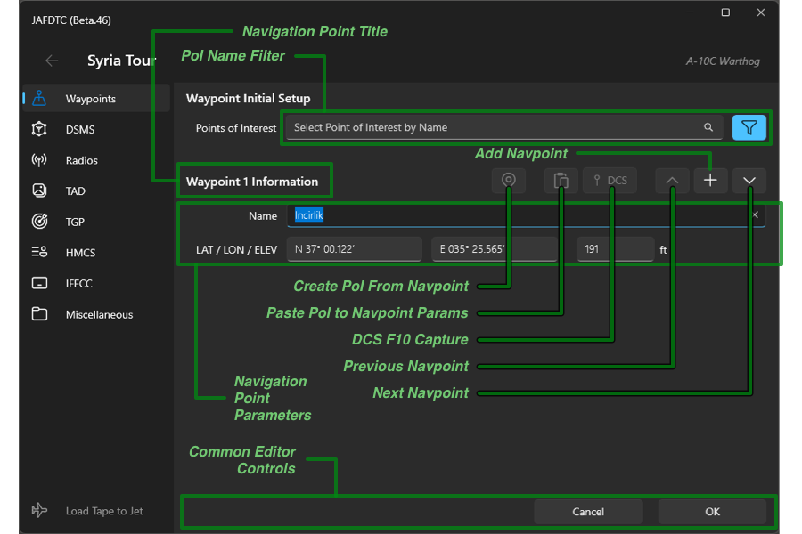
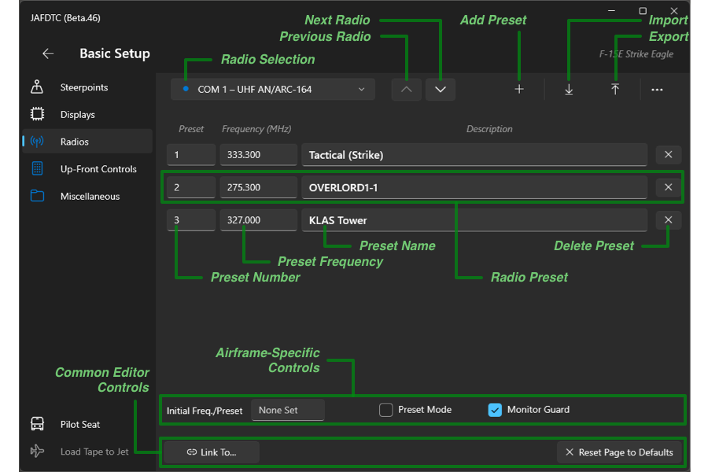

# JAFDTC: Common Elements Guide

**_Version 1.1.2 of 22 November 2025_**

Though systems differ from airframe to airframe, based on the preculariites of the airframe,
there are many concepts, layouts, and tasks in the JAFDTC user interface that share general
similarities across airframes even where the specifics differ. This guide discusses these
common areas.

As always, please consult the airframe guides for further details on a specific airframe.

* [A-10C Warthog](https://github.com/51st-Vfw/JAFDTC/tree/master/doc/Airframe_A10C.md)
* [F-14A/B Tomcat](https://github.com/51st-Vfw/JAFDTC/tree/master/doc/Airframe_F14AB.md)
* [F&#x2011;15E&nbsp;Strike&nbsp;Eagle](https://github.com/51st-Vfw/JAFDTC/tree/master/doc/Airframe_F15E.md)
* [F-16C Viper](https://github.com/51st-Vfw/JAFDTC/tree/master/doc/Airframe_F16C.md)
* [F/A-18C Hornet](https://github.com/51st-Vfw/JAFDTC/tree/master/doc/Airframe_FA18C.md)

This guide starts by looking at sharing information between pilots before discussing common
user interface and interaction techniques.

# Sharing Configurations

As mentioned in the
[User's Guide](https://github.com/51st-Vfw/JAFDTC/tree/master/doc/README.md),
JAFDTC can share configurations through the import and export of `.jafdtc` files. These files
can be passed between pilots to allow sharing of key information for a sortie. Using
[configuration composition](https://github.com/51st-Vfw/JAFDTC/tree/master/doc/README.md#linking-systems),
a shared configuration can be combined with pilot-specific information to build a custom
configuration for a specific pilot in an element.

You can import a `.jafdtc` file either through an import control in the user interface (such
as the **Import** button on the
[configuration list page](https://github.com/51st-Vfw/JAFDTC/tree/master/doc/README.md#configuration-list-page))
or by simply double-clicking a `.jafdtc` file from Widnows File Explorer. After doing so,
JAFDTC displays the following dialog,

There are two fields in this dialog. The top field, (1), selects the name for the imported
configuration. The bottom field, (2), specifies the pilot role to apply during import and is
optional.

Roles allow JAFDTC to customize the configration in the `.jafdtc` file prior to import. This
allows you to distribute a single `.jafdtc` file to all members of the flight and have JAFDTC
update it as appropriate for each pilot's position in the flight. This is airframe-dependent.

> The *Pilot Role* field is only present for airframes that support roles no import. As a
> result, roles, and how they modify an imported configuration, are airframe-specific and
> discussed further in the relevant
> [airframe guide](https://github.com/51st-Vfw/JAFDTC/tree/master/doc/README.md#what-now).

After filling in the fields, pressing **OK** will build a new configuration in your
configuration library using the imported `.jafdtc` file.

# Sharing Databases

JAFDTC contains a number of user-editable databases such as the
[point of interest database](https://github.com/51st-Vfw/JAFDTC/tree/master/doc/README.md#points-of-interest).
Selections from these databases can be exported to `.jafdtc_db` files through the user
interface to allow you to easily exchange information with other pilots. For example, you can
use a `.jafdtc_db` file that contains exported POIs from a campaign to share common locations
with others. Updates to the POIs can be made and then redistributed to others.

You can import a `.jafdtc_db` into a database at appropriate points in the user interface.
In addition, double-clicking on a `.jafdtc_db` file in Windows File Explorer will cause
JAFDTC to import the database file into the appropriate database.

A workflow might look like this,

* Mission commanders build a set of Campaign POIs in the
  [point of interest database](https://github.com/51st-Vfw/JAFDTC/tree/master/doc/README.md#points-of-interest)
  that contains navigation and target locations relevant to the mission set.
* Mission commanders export the campaign as a `.jafdtc_db` file using the
  [point of interest database page](https://github.com/51st-Vfw/JAFDTC/tree/master/doc/README.md#points-of-interest-database-page).
* The `.jafdtc_db` file is provided to pilots for import into their JAFDTC databases.
* Flight leads build steerpoints and so on based in part on the appropriate campaign POIs.
* Following the mission, mission commanders update the campaign POIs (for example, removing
  destroyed targets or adding new targets) and the process repeats with the export of a new
  `.jafdtc_db` file.

Other approaches are possible as well.

# Common Interface Tasks

The JAFDTC user interface has tasks that can be used in multiple contexts within an airframe as
well as tasks that may share some common features across different airframes. This section
discusses these tasks from a perspective independent of airframe. Where appropriate, the 
[airframe guides](https://github.com/51st-Vfw/JAFDTC/tree/master/doc/README.md#what-now)
will expand on this material with airframe-specific details.

## Loading a Configuration Into the Jet

> This section focuses on JAFDTC configuration capabilities independent of the native DCS DTC.
> The
> [next section](#working-with-the-dcs-dtc)
> discusses how JAFDTC can work with the native DCS DTC to configure the jet.

The primary interaction between JAFDTC and DCS involves uploading configurations to the jet. To
upload, four conditions must hold,

1. JAFDTC DCS
   [scripting support](https://github.com/51st-Vfw/JAFDTC/tree/master/doc/README.md#dcs-support-scripts)
   must be installed.
2. DCS must be running.
3. A configuration must be selected from the
   [*Configuration List Page*](https://github.com/51st-Vfw/JAFDTC/tree/master/doc/README.md#configuration-list-page)
   in the JAFDTC user interface.
4. A mission must be running in DCS with a pilot in pit of an airframe that matches the
   airframe of the configuration that is selected in (3).

The
[status area](https://github.com/51st-Vfw/JAFDTC/tree/master/doc/README.md#status-area)
in the lower left corner of the
[*Configuration List Page*](https://github.com/51st-Vfw/JAFDTC/tree/master/doc/README.md#configuration-list-page)
indicates the status of these conditions.
Once these conditions are met, you can use any of the **Load to Jet** buttons in the interface
to load the currently selected configuration to the jet. These buttons use an aircraft icon
and indicate the status of the operation as below,

**TODO REBUILD**

The outline version shows when the jet is unavailable (dimmed) or ready to accept a
configuration (not dimmed). If the icon is dimmed and filled in, an upload is currently in
progress.

> Some airframes also support triggering loads via cockpit controls as discussed
> [below](#vr-quality-of-life-improvements).
> Consult the
> [airframe guides](https://github.com/51st-Vfw/JAFDTC/tree/master/doc/README.md#what-now)
> for additional details on what capabilities a particular airframe supports.

Generally, an upload should take place before any changes are made to the avionics with all
relevant systems powered up. Typically, after startup but before taxi.

> In some cases, it is difficult to impossible for JAFDTC to get the jet in a known
> configuration from a non-default starting point. In these situations, JAFDTC must rely on the
> avionics being in a known state coming out of a cold or hot start. For example, if there is a
> 4-position switch whose setting JAFDTC is unable to read, JAFDTC may not be able to reliably
> set the switch to a particular setting except if assumes the switch hasn't changed positions
> since mission start.
>
> For these reasons, it is generally advisable to perform JAFDTC uploads prior to manually
> changing any avionics settings that overlap with those in the JAFDTC configuration.

Because JAFDTC works through the clickable cockpit, you should limit your interactions with
cockpit switches while JAFDTC is loading a configuration. Interacting with controls that
JAFDTC will use may cause incorrect command sequences that will mess up the configuration.

## Working With the Native DCS DTC

JAFDTC can interoperate with the native DTC system that ED began rolling out in the DCS
2.9.15.9408 release.

> At present, there are only two airframes (F-16C and F/A-18C) that both JAFDTC and the
> DCS DTC support. Of these, JAFDTC currently only fully supports the F-16C; F/A-18C
> support is planned.

Conceptually, we can classify a particular system parameter (for example, the frequency for
a preset on a radio) into one of three categories,

- **DCS DTC Only** &ndash; Parameters that can only be set through the DCS DTC that JAFDTC
   not support. For example, threat information for the countermeasures system.
- **JAFDTC Only** &ndash; Parameters that can only be set thorugh JAFDTC that DCS DTC does
   not support. For example, navigation points for the navigation system.
- **Any DTC** &ndash; Parameters that can be set through either the DCS DTC or JAFDTC. For
   example, radio preset frequencies.

> These classifications will change over time as JAFDTC and the DCS DTC evolve and improve.
> For exmaple, though not supported in the initial release, the DCS DTC will eventually
> support navigation points.

Before discussing the common UI JAFDTC uses to manage interoperation, it is helpful to first
discuss basic concepts.

### Basics of Merging

JAFDTC allows you to "merge" parts of a JAFDTC configuration into a DCS `.dtc` file that
can be loaded into the jet through the DCS UI rather than through the JAFDTC interface to the
clickable cockpit. Generally, the DCS DTC load is much faster than JAFDTC can achieve. Merging
occurs on a system-by-system basis. The following picture illustrates this concept. For now,
assume there is one system in the jet.

JAFDTC combines a "*Base DCS DTC File*" and a "*JAFDTC Configuration File*" to create a
"*Merged DCS DTC File*". The merged file, along with the JAFDTC configuration file then
each program parameters into the jet through their respective mechanisms.

In this example, there are three types of parameters across the various files (remember that
we are assuming avionics with only one system),

- **Pn** &ndash; There are four of these parameters (**P1** &ndash; **P4**), they are present
  in both JAFDTC and DCS DTC, though JAFDTC only specifies values for **P1** and **P2** in
  its configuration.
- **In** &ndash; There is one of these parameters (**I1**), this is present only in DCS DTC.
- **Dn** &ndash; There is one of these parameters (**D1**), this is present only in JAFDTC.

For each parameter **X** that can be set by the DCS DTC and is part of a system that has been
marked to merge (more on this below), JAFDTC constructs a merged `.dtc` file according to
these rules

- If **X** can be set by only DCS DTC the value in the merged `.dtc` is given by
  **Base DCS DTC File**.
- If **X** can be set by both DCS DTC and JAFDTC the value in the merged `.dtc` is given by,
  - **JAFDTC Configuration File** &ndash; If **X** is specified in the JAFDTC configuration
  - **Base DCS DTC File** &ndash; if **X** is *not* specified in the JAFDTC configuration

During configuration load,

- JAFDTC sets any parameters that it can specify but DCS DTC cannot specify.
- JAFDTC sets any parameters that it can specify in systems that are not marked as merged
  with the DCS DTC (note if the DCS DTC is used, it will also set these parameters).
- DCS DTC sets all other parameters if the DCS DTC is used.

In the example, **P1** is merged, replacing **P1** from DCS DTC with the value from JAFDTC.
**I1** is given by DCS DTC as JAFDTC cannot specify that parameter. **D1** is given by
JAFDTC as DCS DTC cannot specify that parameter.

## User Interface for DTC Interoperation

The user interface that supports JAFDTC and DCS DTC interoperation is largely common across
all airframes that support the DCS DTC. Based on the discussion above, the UI needs to provide
the following information,

* A DCS DTC base file. This effectively specifies "default" values for parameters that the
  DCS DTC can specify.
* A list of JAFDTC systems that are to be merged with the DCS DTC. JAFDTC systems that are
  not supported by the DCS DTC cannot, obviously, be merged. For systems that can be merged,
  the user has the option of merging or not.

> When a system can be merged, but is not, its parameters will be set by *both* DCS DTC and
> JAFDTC. At this point, order of loading (that is, do you load from DCS DTC before or after
> loading from JAFDTC?) determines the final value in the jet.

The common user interface to specify this information looks like this,

There are four areas of interest on this page. The bottom part of the editor, (5), includes the
standard controls for linking systems and operates as
[discussed earlier](https://github.com/51st-Vfw/JAFDTC/tree/master/doc/README.md#common-editor-controls).

### Specifying the Base DTC Tape

The combo box at the top of the page in area (1) allows you to select a base DTC tape (in the
form of a DCS `.dtc` file) upon which JAFDTC builds the merged tape. JAFDTC includes default
templates that provide the default DCS DTC setup for each supported airframe. As
[discussed below](#creating-dcs-dtc-template-files)
you can also build your own templates using the DCS DTC editor.

To use a template you have built, you can import it into JAFDTC using the **Import** button to
the right of the combo box. This will make a copy of the template `.dtc` file into the JAFDTC
configuration library.

To delete a template, select it in the combo box and then click the **Delete** button on the
right of area (1). You cannot delete the default template. This removes the template from the
JAFDTC configuration library and will cause any configurations that use the template to revert
to the default template.

### Specifying the Systems to Merge

The area marked (2) in the figure allows you to select the systems that are to be merged into
the merged DTC tape. This section will show a list of all systems in the configuration that can
be merged. In this example for the Viper, the Radios and Countermeasures settings can be merged
into a merged DTC. Clicking on a system toggles it between a "merge" and "don't merge" state.
In the figure, the Radios system is set to be merged, while the Countermeasures system is not.

> Different airframes may support different systems as mergable.

Systems that are marked as merged on configured using a mix of the settings in the base DTC
tape and the JAFDTC configuration, with the latter providing the value for a parameter when
both specify a value. Systems that are marked as "don't merge" area configured with settings
from JAFDTC. These settings may be over-written if the DCS DTC is used after JAFDTC configures
the jet.

### Specifying the Location to Save the Merged Tape

Specifying where to create the merged `.dtc` file is done in area (3) of the figure above. A
location is set by first clicking on the **Save** button at the right of the area. Doing so
opens up a file picker that lets you specify the location for the merged `.dtc` file.

> A good place to put merged `.dtc` files is in the `Missions` directory in your DCS
> `Saved Games` area as this is the default directory DCS opens when importing a `.dtc` file.

Once a location has been specified and appears in the text field at the left of the area,
clicking the **Save** button will regenerate the merged `.dtc` file with the current
configuration.

You can clear a selected save path with the **Clear** button. Note that while there is no
save path specified, JAFDTC will *not* generate a merged `.dtc` file.

### General Behaviors

The final area of the interface, (4), sets two DTC-related behaviors for JAFDTC.

When enabled, JAFDTC will automatically rebuild the merged `.dtc` file any time one of the
merged systems is changed in JAFDTC. This unconditionally over-writes any previous file. If
this behavior is not enabled, it is the user's responsibility to rebuild the merged `.dtc`
file whenever there are changes to any merged system by using the **Save** button
[discussed earlier](#specifying-the-location-to-save-the-merged-tape).

> For airframes that support opening the DCS DTC interface through cockpit controls, JAFDTC
> will automatically rebuild the tape prior to opening the interface. See the
> [airframe guides](https://github.com/51st-Vfw/JAFDTC/tree/master/doc/README.md#what-now)
> for more details.

When enabled, JAFDTC will generate commands to load the `.dtc` file through the aircraft's
DTC system prior to loading its own configuration. If this behavior is not enabled, the
pilot is responsible for loading any desired DCS DTC configuration.

> JAFDTC generally assumes that the DTC is loaded **before** JAFDTC uploads its configuration.
> Loading the DTC after a JAFDTC upload can replace JAFDTC settings with those from the DCS
> DTC.

### Creating DCS DTC Template Files

A base `.dtc` files for use by JAFDTC as templates for merged `.dtc` files is simply an
exported `.dtc` file as produced by the export command in the DCS DTC. You can use the
DCS DTC to setup the desired defaults for the parameters the DCS DTC can configure.
After exporting, the `.dtc` file can be selected through the
[import function](#specifying-the-base-dtc-tape)
in the JAFDTC UI.

The relevant commands in the DCS DTC UI are shown in the following screenshot.

Clicking on the **File** text drops down a file menu with a number of commands. The
**Save As...** command specifies the name of the DTC tape as it appears in the DTC
interface in the aircraft. The **Export** command opens up a picker that allows you to
select a `.dtc` file to export the DTC setup to. Once saved, this file can be imported
into JAFDTC as a DCS DTC base file (also referred to as a template).

### Cockpit Workflow Expectations

If you are using the DCS DTC (either on its own or in conjunction with JAFDTC), you will need
to load a `.dtc` tape prior to using the DTC in the aircraft avionics or using JAFDTC, if it
is set up to trigger the DCS DTC as
[described earlier](#general-behaviors).
To do so, you launch the DCS DTC and then use the **Import** command listed on the **File**
menu for the DCS DTC UI as shown in the
[screenshot above](#creating-dcs-dtc-template-files).
You can enter the DCS DTC thorough the **Open DTC** button on the "Fly" screen in the DCS UI
prior to entering the cockpit or thorought the Comm/F10 menu once in pit. In addition, some
airframes may provide a path to enter the DCS DTC UI, see the
[airframe guides](https://github.com/51st-Vfw/JAFDTC/tree/master/doc/README.md#what-now)
for more details.

## VR Quality of Life Improvements

To better support VR and other use cases where it may be difficult to interact with the JAFDTC
Windows UI, some airframes allow cockpit controls to trigger some JAFTDC operations. Generally,
JAFDTC selects controls for unused systems for this purpose (for example, a set of switches for
a system that is not modeled in the module, such as the FLIR UFC controls in the Viper).

> See the
> [airframe guides](https://github.com/51st-Vfw/JAFDTC/tree/master/doc/README.md#what-now)
> for further details on what a given airframe supports.

### Applying Configurations to the Jet from the Cockpit

Some airframes allow cockpit controls to trigger configuration upload to the jet. In these
airframes, clicking a button in the cockpit will case JAFDTC to upload the currently selected
configuration into the jet.

### Changing the Selected Configuration from the Cockpit

Some airframes allow cockpit controls to change the currently selected configuration. With this
capability, you can step sequentially through the configurations. As you change the
configuration in this fashion, JAFDTC will display a small window in DCS with the name of the
currently selected configuration,

This windows only remains on screen briefly as you are stepping through configurations.

# Navigation System Editors

For all airframes, JAFDTC supports a navigation system that allows *Navigation Points* (i.e.,
waypoints or steerpoints) to be input into the avionics as a part of a configuration. JAFDTC
uses two pages to configure these systems,

* [**Navigation Point List**](#navigation-point-editor-ui)
  &ndash; Summarizes the navigation points in the configuration specifies.
* [**Navigation Point Editor**](#navigation-point-list-ui)
  &ndash; Edits the details, such as location or elevation, of a specific navigation point.

While the details may differ from airframe to airframe, as the
[airframe guides](https://github.com/51st-Vfw/JAFDTC/tree/master/doc/README.md)
describe, the general layout and operation of these pages follows a similar pattern.

## Navigation Point List UI

The *Navigation Point List* is the
[system editor](https://github.com/51st-Vfw/JAFDTC/tree/master/doc/README.md#system-editor)
for the navigation point system. This is the page you will see when you select an airframe's
navigation system from the
[system list](https://github.com/51st-Vfw/JAFDTC/tree/master/doc/README.md#system-list).

The command bar at the top of the editor in area (1) allows you to manipulate the items
selected in the navigation point list.

The command bar includes the following commands,

- **Add** &ndash; Adds a new navigation point and opens up the detail editor to set it up.
- **Edit** &ndash; Opens the selected navigation point in the
  [*Navigation Point Editor*](#navigation-point-editor).
- **Copy** &ndash; Copy the selected navigation points to the clipboard.
- **Paste** &ndash; Paste navigation points from the clipboard into the system.
- **Delete** &ndash; Deletes the currnetly selected navigation points from the configuration.
- **Map** &ndash; Opens up the [*Map Window*](TODO).
- **Add From POIs** &ndash; Adds new navigation points from defined POIs.
- **Save to POIs** &ndash; Saves navigation points to the POI database.
- **Import** &ndash;
  [Import](#importing-and-exporting-navigation-points)
  navigation points from a file.
- **Capture** &ndash; Capture navigation points from the DCS F10 view and add them to the
  system.

All airframes generally support the same set of commands.

The list that makes up the bulk of the editor in area (2) summarizes the navigation points,
their coordinates, name, and other airframe-specific information. This information is formated
according to airframe conventions. You can select one or more navigation points from the list
using the usual Windows interactions as well as right-click items to show a context menu with
commands applicable to the selected navigation point.

The bottom part of the editor, (3), includes the
standard controls for linking systems and operates as
[discussed earlier](https://github.com/51st-Vfw/JAFDTC/tree/master/doc/README.md#common-editor-controls).

## Navigation Point Editor UI

Editing a navigation point in the navigation point list, using the **Edit** command or double-
clicking on the navigation point in the navigation point list brings up an editor page,

**TODO REBUILD**

At minimum, the page will contain an interface to the PoI system to allow you to select a PoI
to use for the navigation point (see the
[earlier discussion](#selecting--filtering-points-of-interest)
on selecting points of interest) and a section to edit the key parameters of the navigation
point such as name, latitude, longitude, and elevation. The remainder of the page may differ
from airframe to airframe to adapt to the capabilities of the airframe's navigation system. For
example, the Viper's *Navigation Point Editor* page includes fields to specify a OAP reference
points.

The top section of the page allows you to select points of interest, such as an airbase or
a DPI that is part of a campaign, from the Point of Interest database as
[described above](#selecting--filtering-points-of-interest).

The *Navigation Point Title* identifies the navigation point being edited and, on the right
end of the row, provides five controls. From left to right the buttons are,

- **Create** &ndash; Creates a user PoI from the navigation point parameters.
- **Paste** &ndash; Pastes the parameters for the point of interest selected on the top of the
  page into the navigation point parameters.
- **Capture** &ndash; Captures the navigation point parameters from the DCS F10 map.
- **Previous** &ndash; Moves the editor to the navigation point that preceeds the current point
  in the navigation point list.
- **Add** &ndash; Adds a new navigation point to the end of the navigation point list.
- **Next** &ndash; Moves the editor to the navigation point that follows the current point
  in the navigation point list.

The basic navigation point parameters that all airframes support include: name, latitude,
longitude, and altitude. The specific format of the information (for example, latitude in
degrees-minutes-seconds versus degrees-decimal minutes) depends on the airframe. Fields will
display a red background when they contain an illegal value.

At the bottom of the page are “**OK**” and “**Cancel**” buttons to accept or cancel outstanding
changes. Clicking either of these buttons will take you back to the navigation point list.

## Capturing Coordinates for Navpoints

Both the navigation point list and navigation point editor pages allow you to capture
coordinates for navigation points from the DCS F10 map. The earlier discussion
[here](#capturing-coordinates-from-dcs)
provides an overview of the process.

> Capturing coordinates in this fashion requires access to the F10 map. This implies a
> mission is running with a pilot slotted in pint.

When capturing from the list page, you may capture multiple coordinates and either append new
navigation points to the list or update existing navigation points in the list,

When capturing from a navigation point editor, you are always replacing the coordinate of the
navigation point being edited. If you capture more than one coordinate in this case, only the
first coordinate is used.

See the
[earlier discussion](#capturing-coordinates-from-dcs)
of the user interface JAFDTC uses for coordinate capture.

## Importing and Exporting Navigation Points

TODO what about .jafdtc?

In addition to its own `.jafdtc` format, JAFDTC can import navigation points from DCS `.miz`
and CombatFlite `.cf` files directly.

> For `.miz` import, JAFDTC currently supports Afghanistan, Caucasus, Germany, Iraq, Kola,
> Marianas, Nevada, Persian Gulf, Sinai, South Atlantic, and Syria DCS maps.

When importing navigation points, the imported points can either replace or be appended to the
current list of navigation points. When importing from `.miz` or `.cf` files, JAFDTC also lets
you select the flight within the file that you wish to import navigation points from,

**TODO REBUILD FOR LIGHT MODE ??**

Based on the **Navpoint Import Ignores Airframe**
[setting](https://github.com/51st-Vfw/JAFDTC/tree/master/doc/README.md#settings),
the available flights may include only those flights matching the current airframe or any flight
from the file. Both dialogs allow you to enable or disable the import of *Time on Steerpoint*
information from the imported file. In addition, for `.cf` files, you can choose to import the
take-off steerpoints.

> The *Time on Steerpoint* option is not available on airframes that do not support that
> function.

JAFDTC only exports navigation points as a system within a `.jafdtc` file. Sharing navigation
points in an airframe-neutral format is supported through `.jafdtc_db` files that contain
campaign or user POIs.

# Communications System Editors

Many airframes JAFDTC supports provide a communication system that allows configuration of
radios in the airframe. Typical configuration includes information like preset frequencies,
enabling guard monitoring, and so on.

## Communication System Editor UI

The *Communications System Editor* is the
[system editor](https://github.com/51st-Vfw/JAFDTC/tree/master/doc/README.md#system-editor)
for the communication system. This is the page you will see when you select an airframe's
communications system from the
[system list](https://github.com/51st-Vfw/JAFDTC/tree/master/doc/README.md#system-list).

**TODO REBUILD**

The top row of the page provides controls to select one of the radios to edit from the
communications system. A blue dot next to the name indicates the radio has been modified from
default values. The upward- and downard-pointing chevrons step through the radios.

To the right of these controls is a command bar with three commands:

- **Add** &ndash; Adds a preset to the selected radio.
- **Import** &ndash;
  [Imports](#importing-and-exporting-radio-settings)
  presets from a previously exported file.
- **Export** &ndash;
  [Exports](#importing-and-exporting-radio-settings)
  presets to a file suitable for import later.

The middle part of the page presents a list of defined presets, where each row corresponds to
a single preset for the selected radio. Each preset includes a number, frequency, and
description. The `X` button at the right of the row deletes the preset.

The bottom portion of the page includes airframe-specific controls for airframe-specific
parameters (see the
[airframe guides](https://github.com/51st-Vfw/JAFDTC/tree/master/doc/README.md#what-now)
for further details) along with the common **Link** and **Reset** controls
[discussed earlier](#common-editor-controls).

# What Now?

Now that you are familiar with JAFDTC, you should explore the
[airframe guides](https://github.com/51st-Vfw/JAFDTC/tree/master/doc/README.md#what-now)
for the airframes you want to use JAFDTC. These guides build on the common elements
outlined here to describe specific capabilities of JAFDTC on a particular airframe.