# JAFDTC: User’s Guide

***Version 1.1.0 of TODO***

_Just Another #%*@^!% DTC_ (JAFDTC) is a native Windows application that allows you to upload
data typically saved on a data cartridge in real life, such as steerpoints/waypoints and other
avionics setup, into a DCS module during a flight.

JAFDTC is intended to provide a simple DTC tool that allows avionics setups to be built and
shared across a group of pilots. While it provides some light-weight flight planning
capabilities, JAFDTC is not a full-blown flight planner like CombatFlite (though it may be
sufficient to serve that role depending on your specific needs).

There are three components to the user's guide,

- This document provides a broad overview of JAFDTC
- The
  [*Common Elements Guide*](https://github.com/51st-Vfw/JAFDTC/tree/master/doc/Common_Elements.md)
  discusses topics that are common across multiple airframes
- The
  [airframe guides](#what-now)
  present details that are specific to a particular airframe

General installation and troubleshooting instructions for JAFDTC can be found
[here](https://github.com/51st-Vfw/JAFDTC/tree/master/README.md)
and are not covered in this document.

# Preliminaries

Before discussing the user interface, it is helpful to outline some of the key abstractions
that JAFDTC uses.

## Configurations & Systems

JAFDTC allows you to manage multiple avionics *Configurations* for multiple airframes.
Currently, JAFDTC supports A-10C Warthog, AV-8B Harrier, F-14A/B Tomcat, F-15E Strike Eagle,
F-16C Viper, F/A-18C Hornet, and Mirage M-2000C airframes.

> Most of the development effort has been focused on the Warthog and Viper. Support for
> other airframes may be limited due both to development time as well as module availability.

### Overview

In JAFDTC, a *Configuration* is made up of multiple *System Configurations*, or *Systems*,
that each correspond to systems (strangely enough) in the airframe. Each system has a set
of *Parameters* that JAFDTC can set. For example, a configuration might include systems such
as countermeasures, communications, or navigation. A communication system might have
parameters that specify the frequency mapped to a preset button. The set of *Configurations*,
*Systems*, and *Parameters* are **unique** to a specific airframe, though different airframes
may have similarities.

Each configuration has a unique name identifies the configuration in the user interface. This
name is set up when the configuration is first created and may be changed later.

> Configuration names must be unique across all configurations for an airframe and may contain
> any character. Names are case-insensitive so "A2G" and "a2g" are treated as the same name.

The specific systems available in a configuration, along with the *parameters* of the system
that JAFDTC can set up, vary from airframe to airframe.

> Details specific to a particular airframe can be found in the
> [airframe guides](#what-now)
> linked below.

Some systems may not exist in some airframes and even similar systems may operate differently
in different airframes.

### Storing Configurations

JAFDTC stores configuration and supporting files, such as settings, in the `Documents\JAFDTC`
folder for the active profile. Configurations are found in the `Configs` folder in this
directory. Generally, you should not need to access the files in the `JAFDTC` folder as JAFDTC
supports sharing and exchanging information through various UI functions.

> As with all things, there are exceptions. A good general rule is use the UI and don't try to
> work around it.

### Avionics Defaults

A parameter JAFDTC can configure has a "default" value that corresponds to the state DCS
models when the jet comes out of a cold start in the absence of specific input by the pilot.
Pilot actions may change these values. Generally, JAFDTC has knowledge of default values for
a parameter, but may lack visibility into its current value at a particular point in time.

Because of this, setting a parameter to a "default" value generally implies that JAFDTC will
not change the parameter from its *current* value in the avionics even if the current value
does not match the cold start value. Throughout this document, we will use "default" under
the assumption that the pilot has not changed parameters (so "default" and "current" are the
same value).

### Sharing Configurations

JAFDTC can export and import configurations in a `.jafdtc` file that can be exchanged with
other pilots for mission planning purposes. For more information on sharing configurations,
see the
[*Common Elements Guide*](https://github.com/51st-Vfw/JAFDTC/tree/master/doc/Common_Elements.md).

## Linking Systems

JAFDTC allows you to link *Systems* between different *Configurations* for the same
airframe. When linked, changes to the source system are automatically reflected in all
configurations that link to the source system.

> Links allow you to *compose* configurations from shared system setups. Links are always
> created between systems in configurations for the same airframe.

Links are tracked per system. That is, Systems X and Y in Configuration A can be linked
to those systems in a different configurations if desired. Once linked, changes to a system
are pushed to all linked systems regardless of whehter they are linked directly or
indirectly.

> For example, say System X in Configuration A is linked to Configuration B and System X in
> Configuration B is linked to Configuration C.
>
> Changes to System X in Configuration C will be reflected in System X in both Configraution
> A and B.

Breaking a link preserves the configuration of the system at the time the link is broken.
That is, if systems in Configuration A are linked to Configuration B and you delete
Configuration B, the linked systems in A will retain the values from B at the time B was
deleted.

> Links are **not** preserved across configuration exports and imports. Exporting a system
> generates an unlinked system that shares the setup of the linked system at the time of
> export.

Linked systems are always edited in the source configuration. The system editors in linked
configurations will be read-only while the editor in the source configuration will allow
changes to be made to the system.

Links are particularly useful when you have setups that you tend to reuse often. For example,
you might want to always configure your cockpit displays one way for A2G sorties and another
way for A2A sorties. Let's assume configurations for the airframe support an MFD system (MFD)
that sets up cockpit displays and a navigation system (NAV) that sets up steerpoints. Once
you setup your A2G and A2A MFD configurations, you can link them from new configurations to
avoid having to setup the MFD in each new configuration.

Expanding on this example where a configuration has an MFD and NAV system, consider the
following example,

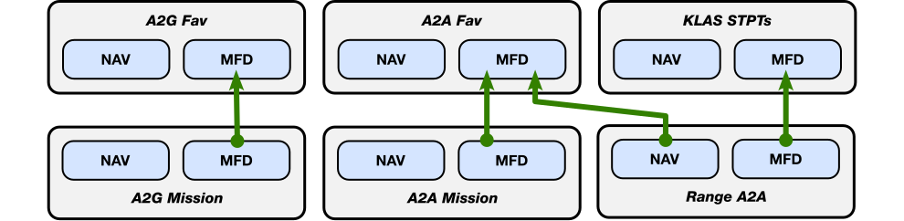

Here, the arrow points to the source system configuration: the MFD system configuration in
"A2G Mission" comes from (or, is *linked to*) the MFD system configuration in "A2G Fav". In
this example, "A2G Mission" would only fully specify the set up for the NAV system; it relies
on the "A2G Fav" to specify the set up for the MFD system.

Any change you make to the MFD system in "A2G Fav" or "A2A Fav" is reflected in the
configurations that link to these system configurations; in this example, "A2G Mission",
"A2A Mission", and "Range A2A". Once linked, only the original is editable. That is, the A2G
MFD system will be read-only in "A2G Mission" but may be edited through "A2G Fav". In
general, changes to a system are pushed to all linked (either directly or indirectly) systems.

Though "A2A Fav" and "A2G Mission" have linked their MFD system configurations, they have
completely independent NAV system configurations as links are system-based.

Further, different systems can link to different configurations. In the above picutre,
"Range A2A" gets it's MFD setup from "A2A Fav" and its NAV setup from "KLAS STPTs". There
is no limit to the number of systems that can link to a particular system configuration.

Links are not affected by changes to configuration names: renaming "A2G Fav" to "A2G Base",
for example, will not break the link with "A2G Mission". In addition, settings are not lost
when you delete a source configuration. For example, though deleting "A2G Fav" will break the
link with "A2G Mission", the MFD settings in "A2G Mission" will match the MFD settings from
"A2G Fav" when the configuration was deleted.

## Points of Interest

JAFDTC supports a collection of points of interest (POI) that can be used to speed up creation
of navigation points or target locations. There are three basic types of POI,

- **DCS** &ndash; Includes airfields and other features defined on the supported DCS maps; for
  example, Nellis AFB from the NTTR map. These POIs are provided by JAFDTC and cannot be edited
  by the user.
- **User** &ndash; Includes individual POIs defined by the user; for example, a commonly used
  navigation point for a map. These POIs are provided by, and can be edited by, the user.
- **Campaign** &ndash; Includes groups of POIs defined by the user that support a group of
  missions; for example, a set of target DPIs for enemy industry in Beirut for a campaign
  set in Syria. These POIs are managed by the user.

Each point of interest includes a name, location (in the form of a latitude, longitude, and
elevation), optional campaign information, and optional user-specified tag information that
classifies the point of interest.

The user interface provides mechanisms to search and select POIs from the set of known
locations. Points of interest are discussed further
[later](#point-of-interest-database).

## DCS Integration

This section focuses on a brief overview of the integration between JAFDTC and DCS. The
[*Common Elements Guide*](https://github.com/51st-Vfw/JAFDTC/tree/master/doc/Common_Elements.md)
covers the user interface aspects in more depth.

### DCS Support Scripts

To work with DCS, JAFDTC installs Lua within the `Scripts` hierarchy in the DCS installation(s)
present in the `Saved Games` folder associated with your profile. JAFDTC can install this
support in up to two places,

- `Saved Games\DCS\Scripts`
- `Saved Games\DCS.openbeta\Scripts`

depending which versions of DCS are installed on your system.

> As of the DCS 2.9.2.49940 release, the open beta and stable versions of DCS are the same
> though the folder names may still reflect the pre-2.9.2.49940 split between stable and
> open beta.

Within these areas, JAFDTC makes three changes,

- Adds scripts in the `Scripts\JAFDTC` folder to enable integration with supported airframes
- Adds `JAFDTCStatusMsgHook.lua` and `JAFDTCWyptCaptureHook.lua` script to the `Scripts\Hooks`
  folder to enables integration with DCS
- Adds a line to `Scripts\Export.lua` to load JAFDTC support into DCS at mission start

JAFDTC will automatically update these files as needed, notifying you when an update is made.

> If DCS is running when JAFDTC installs or updates the DCS support scripts, you should restart
> DCS to make sure DCS picks up the latest version of the DCS support scripts.

While JAFDTC allows you to decline the installation, doing so will prevent JAFDTC from
interacting with DCS in any capacity.

### Working with DCS DTC

ED delivered an initial DTC implementation in DCS 2.9.15.9408 released in April of 2025 that
supports some modules. While the DTC implementation in DCS is not yet complete, it does provide
some advantages over tools like JAFDTC (primarily, by being able to inject configurations
directly into the jet without needing to rely on clicking cockpit controls). JAFDTC provides
the ability to push configurations into the jet through the ED DCS DTC, with some restrictions.
The
[*Common Elements Guide*](https://github.com/51st-Vfw/JAFDTC/tree/master/doc/Common_Elements.md#selecting--filtering-points-of-interest)
and
[airframe guides](#what-now)
provide further discussion on how JAFDTC interoperates with the DCS DTC for those airframes
that support the DCS DTC.

Whether or not there is a place for tools like JAFDTC in the DCS ecosystem over the long
term reamins to be seen.

### Uploading Configurations to DCS

Once set up, a *Configuration* can be uploaded into the corresponding airframe in DCS through
the scripting engine that DCS exposes to the host system. To upload, JAFDTC walks through the
configuration, updating system parameters that differ from their defaults in the jet by
driving the clickable cockpit. For example, consider a BINGO warning system. If you change the
BINGO value from the default for the airframe, JAFDTC will update the BINGO value in the
avionics when uploading. If you do not change the value, JAFDTC will not make any changes to
that parameter in the airframe.

As mentioned earlier, this setup may be performed in conjunction with the setup the DCS DTC
performs.

### Capturing Coordinates From DCS

JAFDTC can capture latitude, longitude, and elevation values from the DCS F10 map for use in a
system configuration (such as the location of a navigation point) as well as the point of
interest database. The user interface for coordinate capture from DCS is covered further
[below](#capturing-coordinates-from-dcs-1).

# User Interface Basics

The JAFDTC user interface is based around a single window that displays a list of configrations
for an airframe and allows you to edit the specfic systems in a configuration. This section
covers the aspects of this user interface that are independent of the specific airframe.
Additional details on user interface elements that are common to multiple airframes can be
found in the
[*Common Elements Guide*](https://github.com/51st-Vfw/JAFDTC/tree/master/doc/Common_Elements.md)
while details that are specific to a single airframe can be found in the
[airframe guides](#what-now)
linked below.

## Configuration List Page

The main window of the JAFDTC user interface contains the *Configuration List Page* that
provides a number of controls to manipulate configurations. This page is visible after
launching JAFDTC.

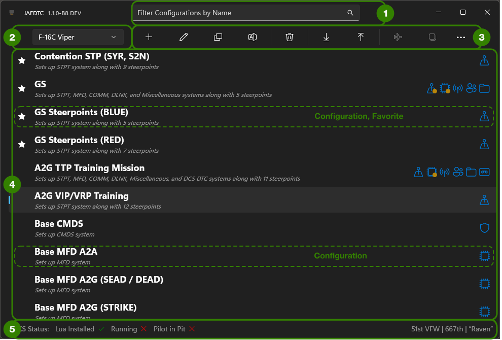

Working from top to bottom, the primary components of this page include,

1. [***Filter Field***](#filter-field)
   &ndash; Filters the configurations shown in the configuration list by name.
2. [***Current Airframe***](#current-airframe-selection)
   &ndash; Selects the current airframe to display configurations for.
3. [***Command Bar***](#command-bar)
   &ndash; Triggers commands to manipulate configurations.
4. [***Configuration List***](#configuration-list)
   &ndash; Lists the available configurations for the current airframe.
5. [***Status Area***](#status-area)
   &ndash; Shows information on the current DCS status and pilot.

The reaminder of this section discusses each of these elements in more detail.

### Filter Field

The filter field in (1) controls which configurations the
[*Configuration List*](#configuration-list)
in the center of the page displays. To be displayed in the configuration list, a configuration
must match the filter by containing the specified text. For example, typing `test` will match
configurations that contain "test" anywhere in their name (comparisons are case-insensitive).

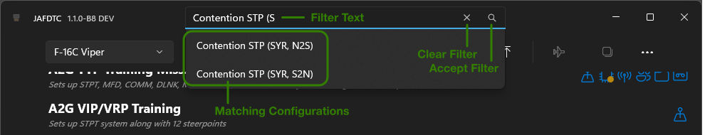

As you type, the application will show a list of matching configurations. Typing `Return` or
clicking on the **Accept Filter** icon will select the filter. You can pick a specific
configuration by clicking on its name in the matching configuration list. Clicking on the `X`
**Clear Filter** icon will remove any filtering and display all configurations for the current
airframe.

### Current Airframe Selection

The combo box control in the upper right of the page in area (2) selects the airframe currently
in use. The
[*Configuration List*](#configuration-list)
in area (4) that makes up the bulk of the page displays known configurations for the selected
airframe only. JAFDTC remembers the last airframe you selected and will return to that airframe
the next time it is launched.

### Command Bar

The command bar at the top of the page in area (3) provides quick access to the operations you
can perform on configurations. Clicking on the `...` button at the right of the bar displays
the command bar in its "open" state that includes the secondary commands along with help text
for all commands.

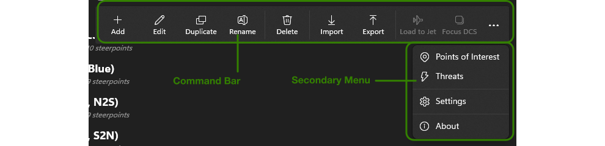

The command bar includes the following commands,

- **Add** &ndash; Adds a new configuration to the database after prompting for a name for the new
  configuration.
- **Edit** &ndash; Navigates to the
  [System Editor Page](#system-editor-page)
  for the selected configuration to allow you to edit the configuration. You can also edit a
  configuration by double-clicking on the configuration in the configuration list.
- **Duplicate** &ndash; Creates a copy of the selected configuration after prompting for a name for the
  copy of the configuration.
- **Rename** &ndash; Renames the selected configuration.
- **Delete** &ndash; Removes the currently selected configuration from the database.
- **Import** &ndash; Creates a new configuration from a `.jafdtc` file previously created with the
  *Export* command. `.jafdtc` files are discused further in the
  [*Common Elements Guide*](https://github.com/51st-Vfw/JAFDTC/tree/master/doc/Common_Elements.md).
- **Export** &ndash; Creates a `.jafdtc` file that contains the selected configuration suitable for
  import using the *Import* command.  `.jafdtc` files are discused further in the
  [*Common Elements Guide*](https://github.com/51st-Vfw/JAFDTC/tree/master/doc/Common_Elements.md).
- **Load to Jet** &ndash; Uploads the selected configuration to DCS, see
  [here](#interacting-with-dcs)
  for further details.
- **Focus DCS** &ndash; Brings DCS to the foreground and makes it the active application.

> Importing a configuration breaks any
> [links](#linking-systems)
> to other configurations that may have been in place at the time of export as
> [mentioned earlier](#linking-systems).
> The configuration will match the linked configuration at export, but will no longer update
> when changes are made to the source configuration.

The overflow menu (exposed by clicking on the "`...`" button) holds three commands,

- **Points of Interest** &ndash; Navigates to the
  [POI Editor](#point-of-interest-database)
  page to allow you to edit points of interest.
- **Settings** &ndash; Opens up the
  [JAFDTC Settings](#settings)
  dialog to allow you to change JAFDTC settings.
- **About** &ndash; Opens a dialog box that identifies the JAFDTC version.

Depending on the state of the system, commands may be disabled. For example, **Edit** is disabled
when there is no configuration selected and **Load to Jet** is disabled if DCS is not running
a mission with the appropriate airframe.

### Configuration List

Configurations in the list are sorted alphabetically, with favorites appearing first. On the
left side of a row is the name of the configuration, a favorite icon (if the configuration is
marked as a favorite), and a brief summary of what systems the configuration updates. On the
right side of the row is a set of icons that also indicate which systems the configuration
modifies and which systems are linked to other configurations. Systems that are linked to
other configurations are shown with a small gold dot in the lower right corner of their icon.
This list allows at most one configuration to be selected at a time.

Double-clicking a row will open up the
[*System Editor Page*](#system-editor-page)
for the configuration that allows you to edit information in the configuration. Right-clicking
on a row will bring up a context menu with operations, such as **Rename** or **Delete**, that
you can perform on the clicked configuration. 

### Status Area

The status area occupies the bottom part of the configuration list page in area (5). On the
right side of this region is the *DCS Status* area showing information on the current status
of DCS. There are three pieces of status here, each marked with either a red cross or green
checkmark,

- **Lua Installed** &ndash; Indicates that the Lua support is properly installed in DCS.
- **Running** &ndash; Indicates that DCS is currently running (though not necessarily running
  a mission).
- **Pilot in Pit** &ndash; Indicates that DCS is currently running a mission with a pilot in
  pit along with the type of airframe that is currently in use.

To upload a configuration, all three status items must be marked with a green chekmark.

The left side of the status area is the *Pilot Information* area that identifies the pilot
and wing as specified through the
[JAFDTC Settings](#settings).

## System Editor Page

The *System Editor Page* replaces the
[Configuration List Page](#configuration-list-page)
in the main window when you open a configuration for editing by double-clicking a configuration
or opening on via the **Edit** command in the *Configuration List*
[command bar](#command-bar). This page provides a list of systems from which you can select a
per-system editor to specify the settings for system parameters.

The specific systems availble in a configuration vary from
airframe to airframe. However, the basic structure of the page on which you edit a system
configuration is similar.

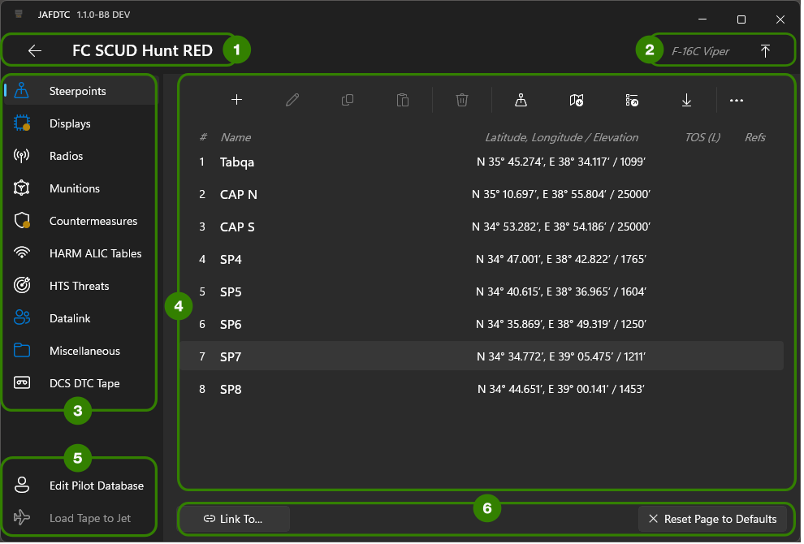

Working from top to bottom, the primary components of this page include,

1. [***Configuration Information***](#system-editor-header)
   &ndash; Provides the name of the current configuration and a control on the left that
   returns to the
   [*Configuration List Page*](#configuration-list-page).
2. [***Airframe Information***](#system-editor-header)
   &ndash; Provides the name of the current airframe and a control on the right to export the
   current configuration to a `.jafdtc` fie.
3. [***System List***](#system-list)
   &ndash; Lists the systems that the configuration can set up.
4. [***System Editor***](#system-editor)
   &ndash; Provides the interface to edit the system selected in the system list.
5. [***Other Controls***](#other-editor-controls)
   &ndash; Airframe-specific controls to manage other aspects of the configuration.
6. [***Common Editor Controls***](#common-editor-controls)
   &ndash; Common controls that are often part of system editors.

The reaminder of this section discusses each of these elements in more detail.

### System Editor Header

At the top of the window in area (1) is the name of the current configuration being edited
along with a back button that returns you to the
[*Configuration List Page*](#configuration-list-page)
when clicked. To the right in area (2) is text identifying the *Current Airframe*.
The button to the right of the current airframe exports the configuration as a `.jafdtc` file,
as discused further in the
[*Common Elements Guide*](https://github.com/51st-Vfw/JAFDTC/tree/master/doc/Common_Elements.md).
This button is functionally identical to the export button on the
[*Configuration List Page*](#configuration-list-page).

### System List

The *System List* in area (3) identifies the systems that make up the configuration. Each
system has an associated icon whose tint and badging specifies details on the configuration.

**TODO REBUILD FOR LIGHT MODE ??**


The tint of the icon indicates the state of the system: white icons mark systems that have not
been changed while tinted icons mark systems whose configuration has changed from defaults.

> JAFDTC uses the system highlight color for tinting; if you change it through Windows
> settings, the blue icons in the screenshots in this guide may be a different color based
> on your choice.

A small gold dot in the lower right corner of the icon marks systems that are linked to
other configurations.

> A white icon with a gold dot indicates a system that is linked to another configuration
> in which the system has not been changed from defaults.

Clicking on a row in this list changes the
[*System Editor*](#system-editor)
panel to the right to a panel appropriate for editing the selected system.

### System Editor

The bulk of the page is taken up by the system editor panel on the right in area (4). The
content of this panel depends on both the system selected from the
[*System List*](#system-list)
to the left along with the airframe. In the figure above, the editor is showing the
steerpoint list associated with the steerpoints system that is selected in the *System List*.
See the
[airframe guides](#what-now)
for further details on the system editors available for a particular airframe.

### Other Editor Controls

Some airframes have additional controls in the lower left corner of the page in area (5).
Geneally, a **Load Tape to Jet** that loads the configuration to the jet is present here
regardless of airframe. Most of the controls in this part of the interface are specific to
an airframe. See the
[airframe guides](#what-now)
for further details on the other editor controls available for a particular airframe.

### Common Editor Controls

Though it varies from system to system, the bottom edge of the system configuration editor for
most systems contains **Link** and **Reset** buttons that provide common link and reset
functions for systems. When present, these buttons perform the same functions regardless of
airframe,

* **Reset** &ndash; Restores the default settings to the system. This is disabled if the system
  is in its default configruation.
* **Link** &ndash; Links or unlinks the system to or from another configuration (see the
  [earlier discussion](#linking-systems)
  on linking systems).

The **Link** button changes based on whether or not the system is linked,

**TODO REBUILD FOR LIGHT MODE ??**


When unlinked, the **Link** button displays "Link To". Clicking the button in this state brings
up a list of potential source configurations that the system can be linked to. Once linked,
the **Link** button displays "Unlink From" along with the name of the linked configuration.

> In the
> [earlier example](#linking-systems),
> to link the MFD configuration in "A2G Fav" to "A2G Mission" you would click the "Link To"
> button in the MFD system editor in "A2G Mission" and select "A2G Fav" from the list of
> configurations to link to.

Once linked, edits to the system configuration are disabled (as you must edit the system
configuration through the source configuration). When unlinking, the system configuration
retains its setup, but will no longer change due to updates from the source configuration.
Icons for linked systems are badged with a small gold dot as described earlier.

## Point of Interest Database Page

JAFDTC provides a *Points of Interest* (POI) database that contains common locations throughout
DCS theaters. This database consists of three types of entries as
[described earlier](#points-of-interest) and is used to help proivde location information to
[navigation system editors](https://github.com/51st-Vfw/JAFDTC/tree/master/doc/Common_Elements.md#navigation-system-editors)
and other location-aware systems.

DCS and User POIs are treated as independent locations in the world. These points are intended
to support usages like tracking an often-used airfield or approach fix to allow the points to
be loaded into a navigation point list in navigation avionics.

Campaign POIs encompass a set of related locations relevant to a mission or set of missions.
These POI sets might include target DPIs for various targets or ingress points for a mission.
While individual DCS and User POIs are independent, Campaign POIs are intended to be managed
as a set.

For example, consider a campaign covering multiple missions. Prior to campaign start, you can
build campaign POIs that include DPIs for all potential targets, ingress and egress
locations, approach fixes for homeplate and alternates, and so on. These can be used in
planning or in a mission in real time to set up pre-planned strike locations, CAP lanes, etc.
As the campaign progresses and targets are destoryed, or new targets become available, the
campaign POIs can be updated and redistributed.

The **Point of Interest** command in the
[overflow menu](#command-bar)
on the
[*Configuration List Page*](#configuration-list-page)
command bar opens up an editor page to manage known points of interest, replacing the
[*Configuration List Page*](#configuration-list-page)
in the main window.

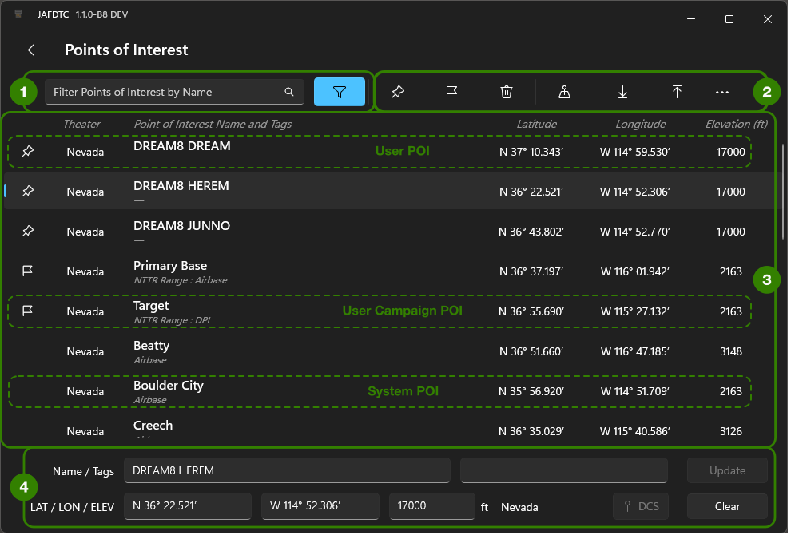

Working from top to bottom, the primary components of this page include,

1. [***POI Filter***](#point-of-interest-filter)
   &ndash; Filters the points of interest displayed in the
   [*Point of Interest List*](#point-of-interst-list).
2. [***Command Bar***](#point-of-interest-command-bar)
   &ndash; Defines operations you can apply to the selected POIs in the
   [*Point of Interest List*](#point-of-interst-list).
3. [***POI List***](#point-of-interest-list)
   &ndash; Lists the POIs that match the current filter the
   [*Point of Interest Filter*](#point-of-interest-filter)
   specifies.
4. [***POI Editor***](#TODO)
   &ndash; Editor to add and update POIs in the database.

The reaminder of this section discusses each of these elements in more detail.

### Point of Interest Filter 

The *Point of Interest Filter* controls at the top left of the window in area (1) allow you
to filter the points of interest listed in the
[*Point of Interest List*](#point-of-interst-list).
These controls operate as described
[below](#selecting--filtering-points-of-interest).

### Point of Interest Command Bar

The command bar in area (2) provides commands you can apply to POIs selected from the
[*Point of Interest List*](#point-of-interst-list),


The command bar includes the following commands,

- **Copy to User** &ndash; Copies the selected POIs to new user POIs.
- **Copy to Campaign** &ndash; Copies the selected POIs to new POIs in a campaign.
- **Delete** &ndash; Deletes the selected POIs from the database. Note that DCS POIs cannot
  be deleted and that deleting all campaign POIs implicitly deletes the campaign.
- **Map** &ndash; Opens up a map window to aid editing POIs.
- **Import** &ndash; Imports POIs from a previously exported file, updating or adding POIs
  as appropriate.
- **Export** &ndash; Exports selected POIs to a file.

The overflow menu (exposed by clicking on the "`...`" button) holds three commands,

- **Add Campaign** &ndash; Creates a new campaign.
- **Delete Campaign** &ndash; Deletes an existing campaign and all associated POIs.
- **Coordiante Format** &ndash; Selects the format (e.g., DMS, DDM) to use to display POI
  coordiantes.

Depending on the state of the system, commands may be disabled. For example, **Delete** is
disabled when the selected POI cannot be deleted. Right-clicking on a POI or selection in
the POI list will display context menu allowing you to perform many of these commands on
the selected POIs.

### Point of Interest List

The *Point of Interest List* in the center of the page lists known points of interest in the
database as filtered by the
[*Point of Interest Filter*](#poiunt-of-interest-filter).
Each row in the *Point of Interest List* corresponds to a single POI in the database and
provides information such as name and position (latitude, longitude, elevation). The icon at
the left of each row in this list indicates the POI type:

- **Pin** &ndash; A user POI.
- **Flag** &ndash; A campaign POI.
- **No Icon** &ndash; A DCS system POI.

The gray text in each row identifies the campaign the POI is associated with along with
any tags associated with the POI. For example, in the image of the POI UI above, the
"Target" POI is a campaign POI from the Nevada theater that is part of the "NTTR Range"
campaign and includes tags of "DPI"

You can select one or more POIs from the table using the standard Windows table interactions
such as `SHIFT`-click to extend the selection, and so on.

### Editing Points of Interest

Clicking on a POI copies its parameters (name, tags, latitude, longitude, and elevation) to
the POI editor at the bottom of the page in area (4). The bottom button in the editor then
changes to,

- **Clear** &ndash; Clears all values from the POI editor and unselects the selected POI in
  the POI list.

While the POI editor has parameters  from a POI, you can update the parameters to make
changes to the selected POI. Once you make a change, the buttons in the editor change to,

- **Update** &ndash; Saves the changes to the POI to the database.
- **Reset** &ndash; Resets any changes in the editor to match the last-saved version of the
  POI.

A red background and border indicates a field is invalid. You will not be able to update the
POI until it is error-free.

To add a new POI, first clear the editor and then enter the name, latitude, longitude, and
elevation (tags are optional). Once you do so, the buttons in the editor change to,

- **Add** &ndash; Adds a new POI to the database with the specified values. On an add, JAFDTC
  will display a dialog allowing you to pick a campaign or user POI type for the new POI.
- **Reset** &ndash; Resets the editor to an empty state.

When DCS is available, coordinates (latitude, longitude, and elevation) can be captured from
DCS and filled in using the DCS pin button in the POI editor. See
[TODO]()
for more information on capturing location information from DCS.

### Exporting Points of Interest

Using the **Export** command from the
[*Point of Interest Command Bar*](#point-of-interest-command-bar)
lets you export selected POIs from the database to a `.jafdtc_db` file. To start an export,
select one or more POIs and then select **Export**. The selected POIs must meet one of two
criteria,

* Selected POIs must all be user POIs.
* Selected POIs must all be campaign POIs from the same campaign.

When exporting a campaign POI, you have the option of exporting only the selected campaign
POIs or including all POIs from the campaign matching the selected POIs. Once what to export
is establisehd, JAFDTC displays a standard Windows file picker to allow you to specify the
file to export to.

Exporting preserves the type and campaign of the exported POIs with one exception: DCS POIs
are always converted to User POIs prior to export.

### Importing Points of Interest

Using the **Import** command from the
[*Point of Interest Command Bar*](#point-of-interest-command-bar)
lets you export selected POIs from the database in `.jafdtc_db` or `CSV` based formats. The
POIs in the file must match the export criteria
[outlined above](#exporting-points-of-interest).

> The `CSV` format is intended primarily for use in creating POI lists for campaigns and
> so on from other source material such as a spreadsheet.

In addition, `.jafdtc_db` files for POIs also can be imported by double-clicking on them
from the Windows File Explorer.

After selecting **Import**, JAFDTC will display a standard Windows file picker to allow you
to specify the file to import from. The import process will update POIs from the database
that match POIs in the imported data. POIs from the import file that are not in the database
are added. When importing a campaign that is also currently in the database, the user can
select merging the imported data or replacing the in-database campaign data with the POIs
from the import file. Campaigns that are not in the database are implicitly created.

The `CSV` format is a text file of lines, one per POI, of comma-separated fields. The format
of the fields on each line is,

```
[name],[tags],[campaign],[latitude],[longitude],[elevation]
```

Where `[name]` and `[campaign]` are strings (`[campaign]` may be empty, `[name]` may not be),
`[tags]` is a semicolon-separated list of tags like "`Airbase;Target;Required`", `[latitude]`
and `[longitude]` are in decimal degrees positions within a DCS theater, and `[elevation]` is
an integer in feet. JAFDTC infers the theater from the latitude and longitude.

## Filtering & Selecting Points of Interest

JAFDTC uses a common set of UI widgets to allow you to filter and select from a list of points
of interest as
[described earlier](#point-of-interest-filter).
This makes it easier to use the POI database by limiting displayed POIs to a relevant subset of
all POIs JAFDTC knows about. The widgets include a search box with a filter button to its
right. The filter button allows you to limit the points of interest to those that meet certain
criteria. The highlight state of the filter button indicates whether or not a filter is being
applied with a tinted or highlighted button indicating the POIs are currently filtered,


Clicking the filter button opens a dialog that lets you specify filter criteria,

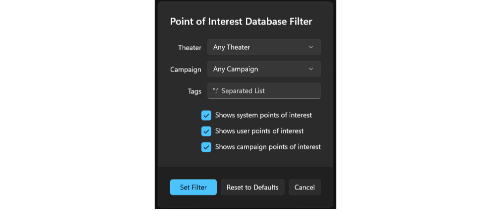

The three buttons at the bottom of the dialog apply changes to the current filter and dismiss
the dialog.

- **Set** &ndash; Sets the filter to match the fields in the dialog.
- **Clear Filters** &ndash; Removes the current filter.
- **Cancel** &ndash; Leaves the current filter unchanged.

The other fields in the dialog together specify the filter,

- **Theater** &ndash; Limits the points of interest to a particular DCS map or theater.
- **Campaign** &ndash; Limits the points of interest to a particular campaign defined in the
  POI database.
- **Tags** &ndash; Limits the points of interest to those that contain the specified tags. For
  eaxmple, setting this field to `foo; bar` matches any point of interest with tags that
  include `foo` and `bar` (comparisons are case-insensitive).
- **Shows...** &ndash; Shows DCS, User, or Campaign points of interest as selected.

For example, setting **Theater** to "Nevada", **Campaign** to "Dark Materials", **Tags** to
"Base; Target", and selecting only **Shows Campaign...** would limit the POIs listed to
campaign POIs that are in Nevada, part of the "Dark Materials" campaign, with either "Base"
or "Target" in their tags.

Once you have set the filter, typing in the search box will show a list of points of interest
with names that match the typed text and other properties (for example, theater) that match the
current filter.

**TODO REBUILD FOR LIGHT MODE ??**
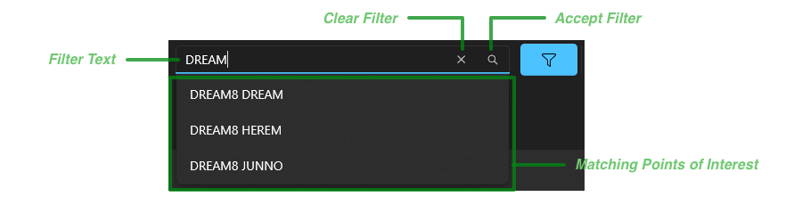

As you type, the list of matching points of interest updates to include the PoIs that match.
Typing `RETURN` or clicking on the **Accept Filter** button sets the filter on names. Clicking
on **Clear Filter** removes the filter on names. Clicking on an item in the matching points of
interest list selects a single PoI.

## Capturing Coordinates from DCS

There are several points in the interface where you can capture coordiantes from the DCS F10
map for use by JAFDTC including navigation point editors or the
[Point of Interest Database](#points-of-interest).
Typically, JAFDTC uses a button like this to start the capture process,

**TODO REBUILD FOR LIGHT MODE**


Clicking on this button starts DCS F10 capture. During this process, JAFDTC displays a dialog
like this that remains visible while you interact with DCS,

**TODO REBUILD**
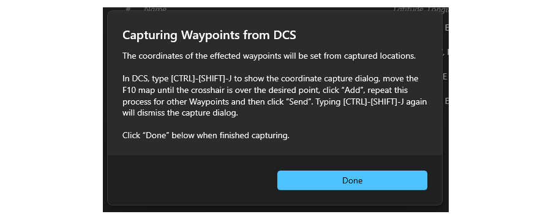

JAFDTC will interact with the coordinate capture in DCS as long as this dialog is active. After
you have completed the capture in DCS, clicking “**Done**” in this dialog incorporates the
captured coordinates into JAFDTC as appropriate.

The DCS side of the interaction occurs on the F10 map.

> You must be in an in-mission slot viewing the F10 map in order to capture coordiantes.
> Capture does not work from the DCS Mission Editor.

From the F10 map, type `CTRL`-`SHIFT`-`J` to show the JAFDTC capture overlay on the F10
map,

**TODO REBUILD**
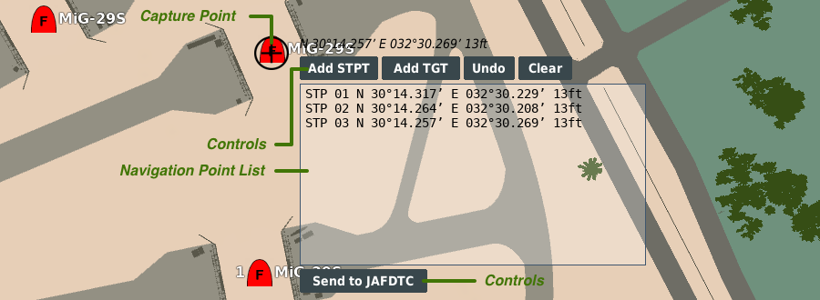

At the upper left of the overlay is a cursor made up of a `+` icon within a circle that
indicates where on the map coordinates are captured from. To the right of this are the
latitude, longitude, and elevation of the point under the `+`. To change the coordinate, move
the F10 map by dragging as usual.

> The overlay remains at a fixed location on the screen while the map moves under the overlay.

The remainder of the overlay includes a list of captured navigation points along with buttons
to interact with the list.

- **Add STPT** &ndash; Adds the location under the cursor to the list of navigation points as a
  steerpoint.
- **Add TGT** &ndash; Adds the location under the cursor to the list of navigation points as a
  target.
- **Undo** &ndash; Removes the last navigation point added to the list.
- **Clear** &ndash; Clears the list of navigation points.
- **Send to JAFDTC** &ndash; Sends the navigation points in the list to JAFDTC to incorporate.

The handling of target versus steerpoints added by **Add STPT** and **Add TGT** commands
depends on the specific airframe. See the
[airframe guides](#what-now)
for further details.

After sending the navigation points to JAFDTC via the **Send to JAFDTC** button, you must
dismiss the “Capturing” dialog in JAFDTC as discussed earlier.

## Settings

You can access the JAFDTC settings through the Settings command on the command bar overflow
menu as
[described earlier](#configuration-list-page).
The settings dialog box appears as follows,

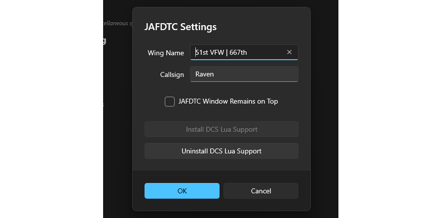

There are multiple controls in the settings,

- **Wing Name**, **Callsign** &ndash; Specifies your wing and callsign. This information
  appears in the
  [status area](#status-area)
  of the
  [configuration list page](#configuration-list-page).
  Some airframes also use this inforamtion for configuration.
- **Upload Feedback** &ndash; Selects the type of feedback to provide during uploads,
  - *Audio Only* &ndash; Audio cues at the start and completion of upload.
  - *Lights Test Only* &ndash; Briefly triggers the "lamp test" function (on some select
     airframes).
  - *Audio &amp; Done Message* &ndash; Audio cues and an on-screen message in DCS indicating
    the upload has finished.
  - *Audio &amp; Progress Messages* &ndash; Audio cues and an on-screen message in DCS
    indicating the progress of the upload.
  - *Audio &amp; Light Test* &ndash; Audio cues and brief trigger of the "lamp test"
    function (on some airframes).
- **Navpoint Import Ignores Airframe** &ndash; When selected, importing navpoints from a
  [file](https://github.com/51st-Vfw/JAFDTC/tree/master/doc/Common_Elements.md#importing-and-exporting-navigation-points)
  will not require the airframe in the file to match the airframe of the configuration.
- **JAFDTC Window Remains on Top** &ndash; Selects whether JAFDTC will always remain on
  top of the window stack, even while DCS has focus. This allows you to keep the DCS UI
  visible in non-VR operation.
- **Check for New Versions at Launch** &ndash; Selects whether JAFDTC will check if a new
  version is available each time it is launched.
- **Install DCS Lua Support** &ndash; Installs
  [DCS Lua support](#dcs-support-scripts)
  if the support is not currently installed (the button is disabled if support is installed).
- **Uninstall DCS Lua Support** &ndash; Uninstalls
  [DCS Lua support](#dcs-support-scripts)
  if the support is currently installed (the button is disabled if support is not installed).

JAFDTC saves its settings to a file in `Documents\JAFDTC`. Clicking “**OK**” will accept any
changes in the dialog, while “**Cancel**” will discard any changes.

# What Now?

Now that you have a basic familiarity with JAFDTC, you can take a look at the
[*Common Elements Guide*](https://github.com/51st-Vfw/JAFDTC/tree/master/doc/Common_Elements.md)
that provides the next level of detail on JAFDTC, its operation, and its user interface. From
there, move on to the airframe guides for airframes of interest,

| Airframe | Systems JAFDTC Can Configure |
|:--------:|------------------------------|
| [A-10C Warthog](https://github.com/51st-Vfw/JAFDTC/tree/master/doc/Airframe_A10C.md) | DSMS, HMCS, IFFCC, Radios, TAD, TGP, Waypoints, Miscellaneous Systems
| [AV-8B Harrier](https://github.com/51st-Vfw/JAFDTC/tree/master/doc/Airframe_AV8B.md) | Waypoints
| [F-14A/B Tomcat](https://github.com/51st-Vfw/JAFDTC/tree/master/doc/Airframe_F14AB.md) | Waypoints
| [F&#x2011;15E&nbsp;Strike&nbsp;Eagle](https://github.com/51st-Vfw/JAFDTC/tree/master/doc/Airframe_F15E.md) | MPD/MPCD Formats, Radios, Steerpoints, Miscellaneous Systems
| [F-16C Viper](https://github.com/51st-Vfw/JAFDTC/tree/master/doc/Airframe_F16C.md) | Countermeasures, Datalink, Data Cartridge (DTC), HARM (ALIC, HTS), MFD Formats, Radios, SMS Munitions, Steerpoints, Miscellaneous Systems
| [F/A-18C Hornet](https://github.com/51st-Vfw/JAFDTC/tree/master/doc/Airframe_FA18C.md) | Countermeasures, Pre-Planned Weapons, Radios, Waypoints
| [Mirage M-2000C](https://github.com/51st-Vfw/JAFDTC/tree/master/doc/Airframe_M2000C.md) | Waypoints

The above links provide additional details on JAFDTC's capabilities and operation on a specific
airframe.
